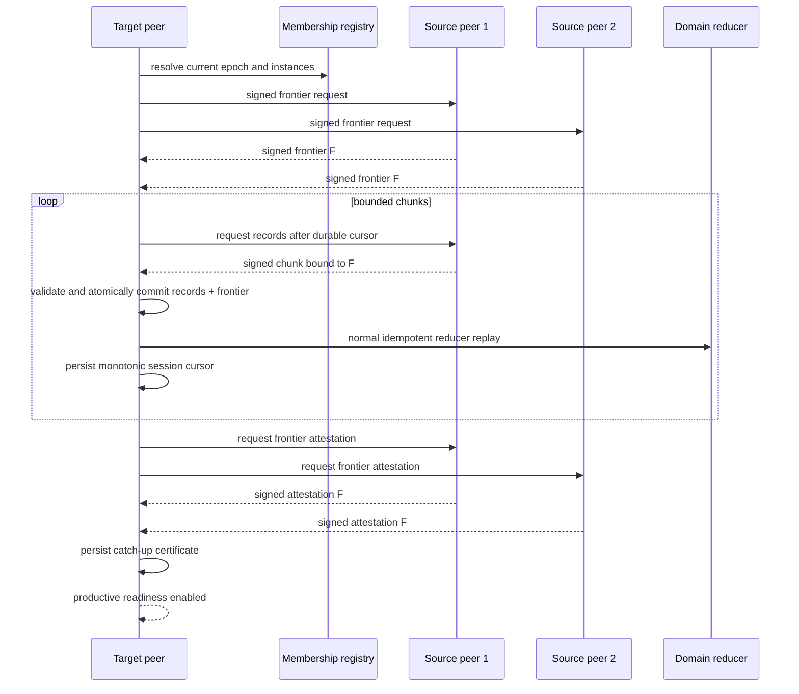

# Authenticated causal state synchronization V1

## Capability

This capability lets a joining, restarted, or partition-healed collective peer
recover missed causal evidence from current members. It uses signed selective
anti-entropy rather than leader-owned snapshots. The result is a durable,
auditable readiness certificate tied to an exact membership epoch and local
frontier.

## Public components

- `@agentplat/collective-sync`: contracts, validation, canonical digests,
  signatures, peer/client orchestration, in-memory persistence, readiness gate,
  and HTTP transport/handler.
- `@agentplat/collective-sync-postgres`: transactional persistence and guarded
  schema lifecycle.
- optional `CollectivePeerNodeSynchronizationPortV1`: fail-closed productive
  runtime integration and exact-predecessor recovery.

## Host integration

Each synchronization domain must define an adapter that validates imported
records and replays them through the same reducers used for live messages. A
host should use narrow domains such as one mission intent or one policy-scoped
planning surface. It must not publish private prompts, credentials, private
reasoning, signing keys, or raw transient model context.

The host publishes accepted live evidence into the append-only repository,
starts or resumes catch-up on join/restart, and exposes readiness through the
node synchronization port. Existing deployments remain unchanged until this
optional port is configured.

## Operational sequence

## Non-goals

V1 does not provide global snapshots, secret replication, arbitrary fork
merging, Byzantine consensus, state compaction, or a new Mesh wire version.
