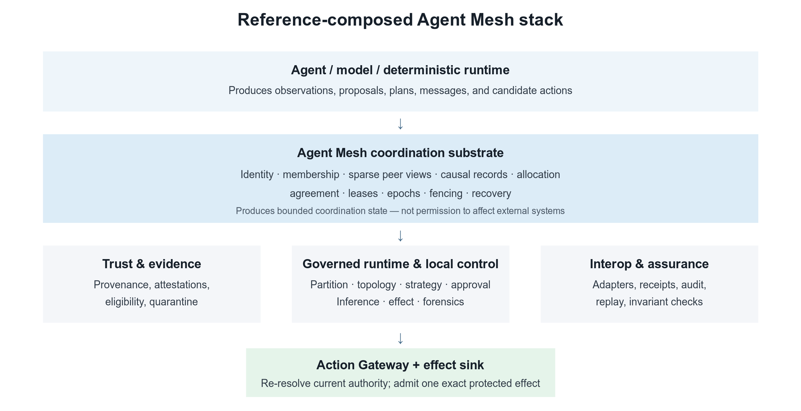
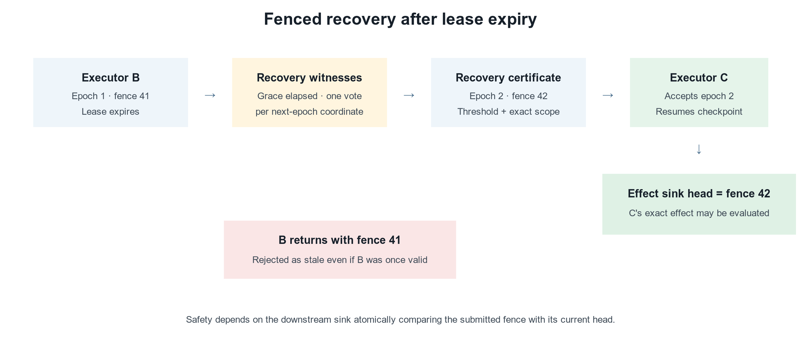

# Agent Mesh: Governed Decentralized Coordination Under Partial Information

## Invariants, Evaluability, and Verifiable Semantic Coordination

**Douglas Rodriguez**  
douglas.rodriguez@trafilea.com  
Version 1.9 — 20 August 2026

### Abstract

Coordinating autonomous software agents requires more than routing prompts among language models. Participants may hold different observations, join and leave during execution, fail independently, disagree about evidence, or attempt actions after their authority has expired. A coordination system must therefore distinguish identity from admission, information from authority, tentative allocation from final assignment, and successful computation from permission to change external state. This paper presents **Agent Mesh**, a provider-neutral coordination substrate for independently executing agents, and its reference composition with adjacent AgentPlat control boundaries. Agent Mesh supplies authenticated and causally linked messages, governed membership, bounded peer views, allocation, agreement, and recovery. The current composed stack adds evidence and Trust, a receipt-producing governed mission cycle, partition and topology policy, approval checkpoints, local inference control, continuity and compromise handling, interoperability, audit, and the fail-closed boundary for protected effects. We explain each mechanism from first principles and use a running five-agent example to show how the mechanisms compose.

The current evidence is a reproducible integration evaluation rather than a claim of deployment performance. It exercises an evaluator-owned horizon of exactly 1,000 semantic decisions, trace and membership binding, sparse-BFT finality, replay, stale-evidence rejection, and recovery of a six-dimensional semantic sidecar. The run produced 973 useful decisions and zero unsafe decisions. These measurements establish the evidence chain and its boundaries; they do not estimate field prevalence or establish general mission performance.

**Keywords:** multi-agent systems; decentralized coordination; agent governance; causal messaging; distributed agreement; reproducible evaluation; AI agents

## 1. Introduction

Software agents increasingly combine generative models, deterministic code, memory, tools, and external services to pursue objectives over multiple steps. When several such agents collaborate, a conversational transcript alone is an insufficient coordination model. The system must answer concrete operational questions: Which participant sent a record? Was that participant admitted to this collective? Which version of the objective was current? Was a work assignment still active? Did a later recovery invalidate an earlier executor? Did several apparent endorsements originate from independent sources? May a proposed action alter external state?

These questions become harder under partial information. A participant may know only a small subset of the collective, messages may arrive late or out of order, and a network partition may isolate otherwise correct processes. Centralized orchestration can simplify this problem when a reliable coordinator has timely global visibility. It can also create a concentrated dependency: unrelated work may wait on one scheduler, all observations may need to converge at one ingress point, and coordinator failure may interrupt the entire mission. Decentralization changes these tradeoffs but does not remove them. It replaces a global coordination assumption with explicit local-state, membership, communication, and quorum assumptions.

Agent Mesh is designed for this setting. It is not a model, an agent persona, or a global “brain.” Strictly, it is the peer protocol, membership, sparse-view, synchronization, allocation, agreement, and recovery layer. AgentPlat's Collective Runtime, Trust, Inference Control, interoperability, audit, and action boundaries are separate packages that can be deployed independently. This paper studies the Mesh-centered **composed collective stack** because the intended safety and adaptation behavior arises from their explicit integration, not from the wire protocol alone. Every peer acts on locally admitted state. Planning evidence does not automatically become execution authority. Missing, stale, conflicting, or unauthenticated inputs fail closed at the boundary where they matter.



The paper makes three contributions. First, it specifies a provider-neutral composition that separates evidence, planning, agreement, assignment authority, and authorization of external effects. Second, it defines bounded integration contracts across identity, discovery, causal synchronization, work allocation, recovery, agent lifecycle, semantic control, and protected effects. Third, it provides evaluator-owned evidence contracts and fail-closed checks that bind semantic decisions to traces, membership, finality, replay, and recoverable artifacts. These contributions lie in system-level composition and auditable invariants, not in claiming invention of established distributed-systems primitives.

A future registered campaign will examine generalization across seeds and environments, comparative performance, semantic-metric calibration, and behavior at larger scales. This paper reports only the current integration evidence.

## 2. A running example

Consider five agents preparing an infrastructure inspection report. Agent A receives the objective and decomposes it. Agents B and C inspect different evidence sources. Agent D checks consistency and provenance. Agent E alone has the capability and authorization path required to publish the final report. During the mission, B becomes unavailable. The collective must assign B's unfinished inspection to C without allowing a delayed process from B's earlier assignment to publish stale work.

This example is intentionally small and non-safety-critical. It is not experimental evidence. Its purpose is to connect the paper's concepts. The objective specifies the outcome and constraints. Peer identities and signed messages establish who authored each record. Capability advertisements help A find candidates. Offers, bids, and awards allocate work. A lease bounds how long an assignment remains active. An assignment epoch and fencing token distinguish the replacement from the stale executor. Evidence claims and attestations preserve provenance. A quorum-backed recovery certificate supports takeover. Finally, a protected-effect gateway checks current authority before E publishes.

## 3. Architectural invariants and essential concepts

Agent Mesh treats coordination as a sequence of locally validated state transitions rather than as a shared conversation. Let `S` be a peer's admitted local state, `r` an incoming record, `a` a proposed protected action, `delta(S,r)` the state transition after admission, and `gate(S,a)` the effect-time authorization decision. A record that fails admission cannot change protocol-authoritative state, and a proposed action cannot reach an external effect without a permit bound to its exact authority context.

The reference implementation targets eleven safety invariants. They are architectural obligations and conformance targets, not universal guarantees under compromised cryptography, storage, quorum assumptions, or effect sinks.

- **I1 — Admission before influence:** a record changes protocol state only after bounded parsing, authentication, tenant and Mesh scope, membership, freshness, replay, and causal checks succeed.
- **I2 — Evidence-authority separation:** evidence, Trust, planning, model output, telemetry, and agreement records cannot by themselves authorize a protected effect.
- **I3 — Exact-effect binding:** a permit binds the normalized action, principal, Objective, Work Item, policy, resource envelope, expiry, idempotency key, assignment epoch, and fence.
- **I4 — Monotonic recovery:** accepted recovery advances the assignment epoch and stable fence; an effect sink rejects lower fences.
- **I5 — No authority by replay:** repeating a valid message or operation identifier cannot create another logical transition or external effect.
- **I6 — Quorum-scoped finality:** a certificate is valid only for its decision coordinate, membership epoch, policy, and eligible voter set.
- **I7 — Fail-closed incompleteness:** missing, stale, conflicting, expired, or unverifiable authority produces denial, replanning, recovery, or safe stop.
- **I8 — Policy attenuation:** local projection may only narrow allowed context, actions, channels, and lifetimes; it cannot broaden the validated baseline.
- **I9 — Composition completeness before start:** the reference-integrated profile cannot begin a mission or effect unless all safety-critical phase handlers are installed.
- **I10 — Bounded degraded operation:** connectivity loss never authorizes an irreversible effect without the required quorum or reconciliation.
- **I11 — Incident authority discontinuity:** recovery from restriction, isolation, or expulsion requires a later epoch, new credential generation, evidence, approval, and no broader successor authority.

These invariants depend on a small set of distinctions:

| Distinction | Meaning in Agent Mesh | Why it matters |
|---|---|---|
| Identity vs. admission | A signature identifies a key holder; membership determines whether that identity may participate in a policy domain. | Authenticated outsiders and removed members gain no protocol authority. |
| Local view vs. global state | Each Mesh Peer retains a bounded neighborhood and scoped records; no complete current global view is assumed. | Absence from one view is not proof of global absence. |
| Evidence vs. authority | Evidence and attestations describe claims and provenance; an explicit authorization transition creates permission. | Plausible or well-supported information cannot silently become effect authority. |
| Allocation vs. assignment | Offers and bids are proposals; an accepted award with lease, epoch, and fence is active assignment authority. | Tentative coordination cannot authorize execution. |
| Computation vs. permission | Successful planning or model output proposes an action; the Action Gateway revalidates current authority before dispatch. | Correct computation can still be unauthorized or stale. |
| Signature vs. truth | A signature proves authorship and integrity, not correctness, competence, or honesty. | Trust remains evidence- and policy-dependent. |

A **Mesh Peer** is an independently executing protocol participant with an identity, local policy, bounded Peer View, and work journal. **Partial information** means no peer is assumed to know every participant, message, plan, or environmental fact. **Membership epochs** order admitted configurations. **Causal links** name predecessor records so receivers can request missing dependencies. **Leases**, **assignment epochs**, and **fencing tokens** bound current execution authority and reject delayed predecessors. A **quorum certificate** proves that the policy-required eligible set accepted one value for an exact coordinate. A **semantic threshold** evaluates a bounded evidence prefix and may allow, steer, replan, abstain, or stop. A **protected effect** is an externally visible change whose gateway must re-resolve authority immediately before dispatch.

The novelty claim is compositional. Agent Mesh does not claim invention of signatures, capabilities, causal clocks, leases, fencing, idempotency, quorum protocols, or task negotiation. It specifies how their records compose across an agent lifecycle and where each boundary must fail closed.

## 4. Related work

Agent Mesh builds on established security and distributed-systems ideas. Dennis and Van Horn formalized capability-addressed protection [16], while Hardy's confused-deputy analysis showed the danger of ambient or incorrectly selected authority [17]. The Action Gateway applies those principles to agent effects through permits bound to current mission, assignment, semantics, replay state, and fencing. Contract Net introduced announcement, bidding, and award for distributed problem solving [4]; Agent Mesh adds signed scope, versioned objectives, explicit lease/fence authority, certified recovery, and effect-time revalidation.

Lamport established causal ordering without synchronized clocks [3]. SWIM separated failure detection from membership dissemination [9], and PBFT made Byzantine assumptions and quorum requirements explicit [5]. Agent Mesh composes related mechanisms but preserves their limits: sparse views are not complete membership, signatures are not truth, and a recovery majority is not automatically Byzantine consensus.

Modern frameworks such as AutoGen, CAMEL, and MetaGPT emphasize conversational decomposition, role specialization, and configurable collaboration [6–8]. Agent Mesh addresses a complementary layer: independently executing participants, bounded local state, explicit authority recovery, and protected effects. AgentBench evaluates model-based agents across interactive environments [10]; the present evaluation instead tests evidence-chain integrity, finality, replay, and fail-closed rejection. The novelty claim is therefore compositional rather than primitive-level.

### 4.1 Relation to DARPA DICE

DARPA's Decentralized Artificial Intelligence through Controlled Emergence (DICE) program calls for decentralized coordination and local inference control in scalable, adaptive, resilient collectives of heterogeneous agents operating under partial information and contested conditions [19, 20]. Agent Mesh is relevant because it combines sparse coordination, partial views, heterogeneous adapters, dynamic organization, recovery, semantic intervention, and effect-time authority enforcement.

The correspondence is incomplete. The current evidence does not establish DICE's requested measurable gains, stochastic convergence guarantees, long-horizon role coherence, robustness against the full adversarial model, or operation at program scale. DICE motivates the research problem and delimits relevance; it is not evidence of compliance, endorsement, or complete satisfaction of program objectives.

## 5. Mechanisms and evidence

The reference composition implements the invariants through a deliberately separated set of mechanisms. The table states what each mechanism protects, which evidence it emits, and how it fails when required inputs are unavailable or invalid.

| Mechanism | Primary invariants | Evidence produced | Fail-closed outcome |
|---|---|---|---|
| Envelope admission and membership | I1, I6 | canonical envelope digest, signer identity, membership epoch, admission decision | reject record |
| Sparse Peer Views and causal synchronization | I1, I10 | view revision, causal parents, bounded delivery and synchronization receipts | defer, request predecessors, or stop propagation |
| Offers, bids, awards, and Work Contracts | I2, I3 | signed proposals, accepted award, scope and resource bindings | no active assignment |
| Leases, epochs, fences, journals, and recovery | I4, I5, I11 | lease state, checkpoint, recovery votes and certificate, successor fence | pause or reject stale executor |
| Evidence Boundary and Trust | I2, I7 | claim digest, provenance, attestations, credibility and eligibility decisions | exclude or escalate |
| Sparse-BFT finality | I6, I10 | proposal, value, membership, signer-set, shard, and finality certificate digests | unresolved or safe stop |
| Inference Control and policy projection | I7, I8 | semantic metrics, evidence prefix, policy version, disposition, sidecar digest | revise, replan, abstain, deny, or safe stop |
| Governed runtime and Action Gateway | I3, I5, I9 | ordered phase receipts, permit, reservation, idempotency and fence bindings | refuse start or deny effect |

The mechanisms are independently deployable packages, but the paper evaluates their reference composition. Agent Mesh provides peer protocol, membership, sparse views, synchronization, allocation, agreement, and recovery. Adjacent AgentPlat packages supply Trust, Inference Control, governed mission phases, audit, interoperability, and protected-effect enforcement. Calling the composition “Agent Mesh” is shorthand; it does not imply that the wire protocol alone performs every control function.

Capability evidence is intentionally typed. A Peer Card or capability advertisement is a signed, expiring claim, not proof of competence or permission. Planning and Team decisions are versioned proposals until projected into current assignment authority. Trust and semantic records may narrow eligibility but cannot grant ambient authority. Effect permission appears only at the Action Gateway and remains conditional on downstream idempotency or fencing.

The implemented scope includes provider-neutral adapters, bounded topology changes, dynamic Team and role decisions, compromise-response inputs, heterogeneous-agent integration surfaces, and deterministic simulation profiles. These are source and conformance capabilities. They do not establish optimal strategy selection, unrestricted organizational emergence, universal compromise detection, deployment-independent human control, or empirical performance at configured maximum scale.

## 6. System model and architecture

For peer `i` at logical step `t`, let `x_i(t)` be durable local state, `v_i(t)` its bounded Peer View, `e_i(t)` newly delivered records, `pi_i(t)` installed policy, and `F_i(t)` the current effect fence:

```text
A_i(t) = admit(e_i(t), x_i(t), v_i(t), pi_i(t))
(x_i(t+1), a_i(t)) = delta_i(x_i(t), A_i(t), pi_i(t))
effect_i(t) = commit(a_i(t), F_i(t)) only if gate_i(...) = allow
```

Admission checks bounded structure, authentication, membership, scope, freshness, replay, causality, and capacity. The local reducer is deterministic and revision checked. The gateway re-resolves authority at effect time; there is no transition from message receipt directly to external action.

### 6.1 End-to-end lifecycle

An authorized issuer signs an Objective. A peer decomposes it into Work Items and discovers candidates from its bounded view. Offers and bids remain proposals until the owner issues an award and the assignee accepts it, producing a Work Contract with lease, epoch, and fence. During execution, journal events, checkpoints, evidence claims, attestations, Trust decisions, and semantic assessments accumulate without becoming ambient authority.

Before a protected effect, the Action Gateway binds the exact action to current membership, Objective, Work Contract, finality record, lease, epoch, fence, semantic decision, and single-use grant. If an assignee fails, recovery witnesses wait for lease and grace expiry, certify at most one eligible next-epoch proposal, advance the fence, and resume from a named checkpoint. Old-epoch effects remain fenced.

The governed runtime orders observation, partition posture, topology, strategy, approval, inference, effect, and forensics. Missing critical handlers prevent start. Durable restart uses compare-and-swap state, rejects stale revisions and epoch regressions, and returns a retained result for a repeated operation only when its digest matches.



### 6.2 Bounds and conditional guarantees

With bounded Peer View size `k`, each peer retains `O(k)` neighbor state. Dissemination fanout and hop limits bound attempted delivery before duplicate suppression. Causal catch-up, agreement rounds, semantic metrics, and artifact replicas are capped by installed policies. These are implementation envelopes, not measured latency or success guarantees.

Safety depends on correct cryptographic verification, current membership and revocation state, durable monotonic storage, correct quorum configuration, and downstream fence enforcement. Liveness additionally requires eventual authenticated delivery, sufficiently available eligible peers, stable policy, and quorum. Permanent partition or threshold loss leads to pause, replanning, recovery, or safe stop.

### 6.3 Threat model

The model includes unauthenticated clients, defective transports, stale or malicious admitted peers, coordinated false evidence, compromised issuers or keys, adversarial JSON, context injection, and adapters that ignore authority. Messages are signed but not inherently encrypted. A compromised threshold can subvert decisions under that threshold model; stale revocation can admit a retired key; and a downstream service that ignores fences can accept stale effects. The architecture makes these assumptions inspectable rather than eliminating them.

## 7. Current integration evaluation

The current evaluation is a deterministic integration smoke, not a preregistered comparative experiment. It generates exactly 1,000 evaluator-owned semantic decisions from the existing semantic-metric engine. Every decision binds execution and registration digests, a trace event and trace digest, membership epoch and configuration, assignment epoch, decision digest, and evidence digest. The projection recomputes a canonical decision root and closes only when the complete horizon and a finality certificate are present.

The evaluator, rather than the caller or runner, owns the decision projection. It orders decisions canonically, rejects duplicate identifiers, verifies that every event belongs to the same execution and registration, and recomputes the trace binding from the trace-event identifier and decision digest. The horizon remains `incomplete` at 999 decisions or when its certificate is absent. This prevents a caller-authored success flag from substituting for the required decision population or finality evidence.

Finality is issued by the reference `InProcessSparseBftFinalityGatewayV1` with four validators and a sparse committee policy. The certificate binds proposal, value, epoch, membership configuration, and signer-set evidence. The evaluator rejects altered trace bindings, stale evidence, invalid decision roots, replay divergence, and incomplete horizons. The runtime also persists a six-dimensional semantic sidecar with the evaluator-owned trace binding, digest, and recoverable artifact content.

The negative-test matrix covers an incomplete 999-decision horizon, caller-owned projections, stale membership or epoch bindings, altered trace identifiers, invalid certificate bindings, and divergent replay. Bundle recovery serializes the complete input and projection, rehydrates them in a fresh object graph, recomputes the projection, and requires equality of the resulting digest. No replay is counted as another decision or experimental sample.

The smoke is run with:

```
pnpm run verify:confirmatory-semantic-horizon-smoke
```

Replays are verification runs, not additional observations. The results demonstrate evidence-chain integrity, finality integration, and fail-closed behavior. They do not estimate mission performance, establish statistical calibration, compare against a centralized planner, or substitute for a future registered campaign.

## 8. Results

### 8.1 Evaluator-owned semantic horizon

The reproducible command `pnpm run verify:confirmatory-semantic-horizon-smoke` generated exactly 1,000 evaluator-owned semantic decisions. Each decision binds the execution and registration digests, trace event and trace digest, membership epoch and configuration, assignment epoch, decision digest, and evidence digest. The projection recomputes a canonical decision root and reaches `complete` only when all 1,000 decisions and a finality certificate are present.

The run produced 973 useful decisions, 27 `not_useful` decisions, and zero unsafe decisions. This is an integration result from a deterministic reference profile, not a population estimate or a deployment-performance claim.

The 27 non-useful decisions were exercised under controlled evaluator profiles: five context-conflict cases, six high-uncertainty cases, six low-action-diversity cases, five low-action-novelty cases, and five controller-restriction cases. These categories demonstrate that the instrument retains reason-bearing semantic evidence. They do not estimate how frequently those causes occur in live workloads.

An exploratory prefix view reported useful-decision rates of 0.980 at 100 decisions, 0.976 at 250, 0.974 at 500, and 0.973 at 1,000. These prefixes are nested views of the same deterministic stream, not independent samples or alternative stopping-rule claims.

### 8.2 Agreement, replay, and artifact recovery

The agreement certificate was issued by `InProcessSparseBftFinalityGatewayV1` using four validators and the reference sparse committee policy. Proposal, value, epoch, membership configuration, and signer-set evidence are bound into the certificate. Exact replay produced an identical projection digest. Altered trace bindings and stale evidence were rejected. The serialized projection and semantic sidecar were rehydrated and reprojected with the same digest.

### 8.3 Semantic sidecar

The runtime reference pilot emits a recoverable six-dimensional evaluator-owned sidecar for every accepted inference event. The reference profile recorded role coherence 10,000 bps, mission alignment 10,000 bps, context conflict 0 bps, uncertainty 0 bps, action diversity 8,000 bps, and action novelty 7,500 bps. These values demonstrate bounded transport, digest binding, and bundle recovery; they are not estimates of field behavior.

### 8.4 Scope of the result

The results establish an auditable evidence chain and its fail-closed behavior. They do not establish production safety, comparative superiority, statistical calibration of semantic metrics, asymptotic scalability, or general mission performance. A future registered campaign, internally designated V29, is planned for those questions.

## 9. Discussion

### 9.1 What the evidence establishes

The source and protocol artifacts establish an implementable architecture with explicit boundaries for authentication, admission, causal state, work authority, recovery, and protected effects. The current package exposes a governed runtime profile, evaluability checks, and a confirmatory-horizon smoke with sparse-BFT finality, replay stability, stale-evidence rejection, and recoverable semantic sidecars. These are source and conformance results, not mission-performance measurements.

The current contribution is the auditable integration path: evaluator-owned semantics, finality, replay, stale-evidence rejection, and recoverable artifacts. Performance and calibration remain open questions.

### 9.2 What the evidence does not establish

The available evidence does not establish production safety, usefulness under nondeterministic workloads, semantic-metric calibration, or generalization to different assessors, policies, memberships, models, or environments. The four-validator in-process gateway exercises the finality contract but does not reproduce independent machines, production key custody, transport failures, or operational adversaries. Exact replay verifies determinism for the retained inputs; it does not establish external validity.

### 9.3 Architectural tradeoffs

Bounded local views reduce the need for a complete topology but introduce reachability and convergence dependence on the overlay. Explicit membership and signatures improve provenance but require current key and revocation state. Leases and fences contain stale executors but require reliable monotonic storage and enforcement by effect sinks. Quorum certificates provide verifiable collective decisions but reduce availability when a threshold cannot be reached. Safe stops preserve authority boundaries but can reduce useful progress.

Centralized coordination may remain preferable for small collectives, stable networks, tasks requiring a complete global view, tightly coupled optimization, or environments where one coordinator can be made sufficiently available. Agent Mesh targets missions that decompose into partially independent scopes, have localized faults, or benefit from continued local operation without a current global plan.


## 10. Threats to validity

**Construct validity.** The useful-decision label and six semantic dimensions are defined by the reference evaluator. The observed 0.973 rate therefore measures this implementation and profile; it is not an independently calibrated measure of general usefulness.

**Internal validity.** The decision generator, evaluator, projection code, sparse-BFT gateway, and replay verifier are software components in the same repository. Negative tests and independent digest recomputation reduce some risks, but correlated implementation defects remain possible.

**External validity.** The evaluation uses one deterministic reference profile, one 1,000-decision stream, four in-process validators, test signatures, and reference semantic values. It does not reproduce independent hosts, production cryptographic custody, live model variation, changing workloads, human intervention, or adversarial networks.

**Statistical scope.** The 1,000 decisions form one deterministic horizon, not 1,000 independent experimental samples. The reported counts are descriptive integration results; no confidence interval, population estimate, comparative effect, or significance claim is made.

## 11. Safety, governance, and responsible use

Agent Mesh is a developer-preview coordination substrate, not a certification of autonomous operation. Deployments must define issuer authority, membership, key custody, storage durability, transport confidentiality, effect sinks, and human oversight. Raw prompts, private reasoning, credentials, and private keys must not enter ordinary telemetry or public evidence artifacts. Signed records may contain sensitive application content and therefore still require access control and data-governance review.

The architecture intentionally fails closed when required authority is missing or stale. This reduces unauthorized effects but does not make every permitted effect safe. Domain-specific validation remains necessary. High-impact applications require independent risk assessment and should not infer suitability from the local simulation described here.

### 11.1 Author contribution, conflicts, and independence

Douglas Rodriguez is the sole author and is responsible for the architecture synthesis, implementation analysis, evidence interpretation, manuscript preparation, and artifact packaging. The author declares no competing interests relevant to this manuscript. Agent Mesh and AgentPlat are not affiliated with, endorsed by, or evaluated by DARPA. References to DICE describe public program objectives and are used only to frame research relevance and unresolved gaps.

## 12. Artifact availability and reproducibility status

The source repository contains the implementation, smoke command, tests, semantic projection contract, finality gateway integration, and the recoverable semantic sidecar format. This paper reports reproducible integration evidence only. Earlier internal campaigns in the repository history were instrument-development runs and are not reported here; no confirmatory or comparative claim is made, and none should be inferred.

The current smoke bundle is intended to be independently rehydrated: the projection, decision root, certificate, trace bindings, semantic sidecars, and replay inputs are retained as content-addressed objects. Digests identify those objects but do not replace them; a publication package must distribute the referenced objects together with the verification command.

## 13. Conclusion

Agent Mesh treats multi-agent coordination as a distributed authority problem rather than only a conversation-design problem. Its peers exchange authenticated, bounded, and causally linked records; maintain governed membership and sparse local views; negotiate work through versioned offers, bids, and awards; and recover through epochs and fences. In the current reference-composed AgentPlat stack, a receipt-producing governed runtime orders partition posture, topology, strategy, approval, inference, effect, and forensics; durable ports add compare-and-swap state, idempotency, causal receipts, and epoch fencing. Adjacent Trust, continuity, compromise, interoperability, audit, and action boundaries evaluate provenance and semantic risk, adapt organization, revoke stale authority, and revalidate an exact action before a protected effect. Each mechanism has explicit assumptions and failure behavior. None creates a global brain, global truth, universal compromise detector, or universal safety guarantee.

The current evidence establishes an auditable integration path with explicit assumptions and fail-closed behavior. Future registered work should test mission outcomes, comparative performance, calibration, and scale; those claims are outside this paper's scope.

## Appendix A. Terminology reference

This appendix expands terms used in the main argument without changing their authority semantics.

- **Agent:** software that selects or proposes actions using models, rules, search, code, or combinations of them.
- **Runtime:** execution environment that provides models, memory, tools, lifecycle services, and adapters to an agent.
- **Mesh Peer:** independently executing participant in the Agent Mesh protocol. Several peers may share a host, but their identities and authority remain distinct.
- **Peer Card:** signed, expiring declaration of supported protocol versions, transport hints, and claimed capabilities. It supports discovery but proves neither competence nor permission.
- **Message envelope:** canonical wrapper binding payload type and digest to sender, instance, tenant, Mesh, protocol version, creation time, expiry, nonce, and causal parents. The signature authenticates this exact wrapper.
- **Peer View:** bounded set of active neighbors and reserve candidates known locally by one peer. The union of Peer Views forms the sparse overlay.
- **Objective:** versioned statement of intended outcome, constraints, policy references, resource bounds, and revision lineage.
- **Work Item:** bounded unit derived from an Objective. An **offer** announces it, a **bid** proposes execution terms, and an **award** selects a candidate. These records remain proposals until accepted into a current Work Contract.
- **Lease:** time-bounded assignment authority. The **assignment epoch** identifies its generation, while the **fencing token** lets state and effect sinks reject delayed predecessors.
- **Causal synchronization:** exchange of records with explicit predecessor identifiers. A receiver that lacks a dependency requests it or defers the dependent transition rather than inventing order.
- **Quorum certificate:** verifiable record that the policy-required eligible set accepted one value for an exact decision coordinate and membership epoch.
- **Journal and checkpoint:** append-only execution history and named resumable state. They support recovery but do not independently authorize takeover.
- **Evidence claim:** content-addressed assertion with provenance and scope. **Attestations** add independently signed evaluations. **Trust** is the local policy result derived from available evidence, not a global truth value.
- **Inference Control:** boundary that evaluates context, role, uncertainty, proposed messages, tools, and actions. It may allow, steer, revise, replan, abstain, escalate, deny, or stop.
- **Semantic sidecar:** recoverable evaluator-owned artifact carrying the six bounded semantic metrics and their trace and digest bindings.
- **Protected effect:** externally visible change requiring explicit authorization. The **Action Gateway** revalidates current assignment, semantic, policy, idempotency, and fence state immediately before dispatch.


## References

[1] A. Rundgren, B. Jordan, and S. Erdtman. “JSON Canonicalization Scheme (JCS).” RFC 8785, 2020. https://www.rfc-editor.org/rfc/rfc8785

[2] S. Josefsson and I. Liusvaara. “Edwards-Curve Digital Signature Algorithm (EdDSA).” RFC 8032, 2017. https://www.rfc-editor.org/rfc/rfc8032

[3] L. Lamport. “Time, Clocks, and the Ordering of Events in a Distributed System.” *Communications of the ACM*, 21(7):558–565, 1978. https://doi.org/10.1145/359545.359563

[4] R. G. Smith. “The Contract Net Protocol: High-Level Communication and Control in a Distributed Problem Solver.” *IEEE Transactions on Computers*, C-29(12):1104–1113, 1980. https://doi.org/10.1109/TC.1980.1675516

[5] M. Castro and B. Liskov. “Practical Byzantine Fault Tolerance.” In *Proceedings of OSDI '99*, 1999. https://www.usenix.org/conference/osdi-99/presentation/practical-byzantine-fault-tolerance

[6] Q. Wu et al. “AutoGen: Enabling Next-Gen LLM Applications via Multi-Agent Conversation.” arXiv:2308.08155, 2023. https://arxiv.org/abs/2308.08155

[7] G. Li, H. A. K. Hammoud, H. Itani, D. Khizbullin, and B. Ghanem. “CAMEL: Communicative Agents for ‘Mind’ Exploration of Large Language Model Society.” arXiv:2303.17760, 2023. https://arxiv.org/abs/2303.17760

[8] S. Hong et al. “MetaGPT: Meta Programming for a Multi-Agent Collaborative Framework.” arXiv:2308.00352, 2023. https://arxiv.org/abs/2308.00352

[9] A. Das, I. Gupta, and A. Motivala. “SWIM: Scalable Weakly-Consistent Infection-Style Process Group Membership Protocol.” In *Proceedings of DSN 2002*, pp. 303–312, 2002. https://www.cs.cornell.edu/projects/quicksilver/public_pdfs/SWIM.pdf

[10] X. Liu et al. “AgentBench: Evaluating LLMs as Agents.” arXiv:2308.03688, 2023. https://arxiv.org/abs/2308.03688

[11] AgentPlat Contributors. “AgentPlat: Open-source runtime primitives for governed agentic platforms.” Source repository. https://github.com/Agentplat/agentplat

[12] AgentPlat Contributors. “Collective Development Capability Matrix V1.” Source and integration inventory. https://github.com/Agentplat/agentplat/blob/main/docs/collective-runtime/development-capability-matrix-v1.md

[13] AgentPlat Contributors. “ADR 0042: Collective Capability Closure.” Reference-integrated architecture decision. https://github.com/Agentplat/agentplat/blob/main/docs/adr/0042-collective-capability-closure.md

[14] AgentPlat Contributors. “Sparse Collective Scale V2.” Capability and integration contract. https://github.com/Agentplat/agentplat/blob/main/docs/agent-mesh/sparse-collective-scale-v2.md

[15] AgentPlat Contributors. “AgentPlat Interoperability SDK.” Provider-neutral agent and simulation protocol. https://github.com/Agentplat/agentplat/tree/main/packages/interop

[16] J. B. Dennis and E. C. Van Horn. “Programming Semantics for Multiprogrammed Computations.” *Communications of the ACM*, 9(3):143–155, 1966. https://doi.org/10.1145/365230.365252

[17] N. Hardy. “The Confused Deputy (or why capabilities might have been invented).” *ACM SIGOPS Operating Systems Review*, 22(4):36–38, 1988. https://doi.org/10.1145/54289.871709

[18] M. Kleppmann. “How to Do Distributed Locking.” 2016. https://martin.kleppmann.com/2016/02/08/how-to-do-distributed-locking.html

[19] Defense Advanced Research Projects Agency. “Decentralized Artificial Intelligence through Controlled Emergence (DICE).” 2026. https://www.darpa.mil/research/programs/decentralized-artificial-intelligence-through-controlled-emergence

[20] Defense Advanced Research Projects Agency. “Decentralized Artificial Intelligence through Controlled Emergence (DICE): Questions and Answers.” 2026. https://www.darpa.mil/sites/default/files/attachment/2026-06/programs-dice-q-a.pdf

[21] AgentPlat Contributors. “Governed Collective Runtime V1.” Provider-neutral receipt-producing mission-cycle facade. 2026. https://github.com/Agentplat/agentplat/blob/main/docs/collective-runtime/governed-collective-runtime-v1.md

[22] AgentPlat Contributors. “Controlled-Emergence Control Plane V1.” Coordination, approval, inference-policy, and Trust-propagation contracts. 2026. https://github.com/Agentplat/agentplat/blob/main/docs/collective-runtime/controlled-emergence-control-plane-v1.md

[23] AgentPlat Contributors. “Release Integration Matrix V1.” Public surfaces, runtime gates, receipt evidence, and release assertions. 2026. https://github.com/Agentplat/agentplat/blob/main/docs/collective-runtime/release-integration-matrix-v1.md

[24] AgentPlat Contributors. “Empirical Evaluability Gate V1.” Deterministic pre-execution certificate for registered endpoints. Commit `490a392`, 2026. https://github.com/Agentplat/agentplat/blob/490a392/scripts/empirical-evaluability-gate.mjs

[25] AgentPlat Contributors. “Empirical Publication Bundle Gate V1.” Independent artifact manifest and analysis reconstruction verifier. Commit `a099ef4`, 2026. https://github.com/Agentplat/agentplat/blob/a099ef4/scripts/empirical-publication-bundle.mjs
