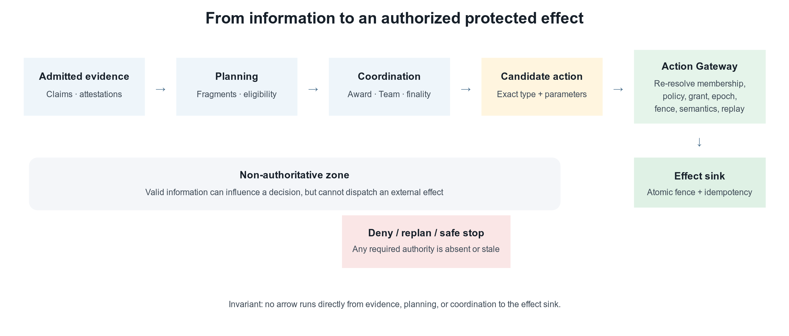

# Agent Mesh: Governed Decentralized Coordination Under Partial Information

## Invariants, Evaluability, and Verifiable Semantic Coordination

**Douglas Rodriguez**  
douglas.rodriguez@trafilea.com  
Version 1.7 — 20 August 2026

### Abstract

Coordinating autonomous software agents requires more than routing prompts among language models. Participants may hold different observations, join and leave during execution, fail independently, disagree about evidence, or attempt actions after their authority has expired. A coordination system must therefore distinguish identity from admission, information from authority, tentative allocation from final assignment, and successful computation from permission to change external state. This paper presents **Agent Mesh**, a provider-neutral coordination substrate for independently executing agents, and its reference composition with adjacent AgentPlat control boundaries. Agent Mesh supplies authenticated and causally linked messages, governed membership, bounded peer views, allocation, agreement, and recovery. The current composed stack adds evidence and Trust, a receipt-producing governed mission cycle, partition and topology policy, approval checkpoints, local inference control, continuity and compromise handling, interoperability, audit, and the fail-closed boundary for protected effects. We explain each mechanism from first principles and use a running five-agent example to show how the mechanisms compose.

The current evidence is a reproducible integration evaluation rather than a claim of deployment performance. It exercises an evaluator-owned horizon of exactly 1,000 semantic decisions, trace and membership binding, sparse-BFT finality, replay, stale-evidence rejection, and recovery of a six-dimensional semantic sidecar. The run produced 973 useful decisions and zero unsafe decisions. These measurements establish the evidence chain and its boundaries; they do not estimate field prevalence or establish general mission performance.

**Keywords:** multi-agent systems; decentralized coordination; agent governance; causal messaging; distributed agreement; reproducible evaluation; AI agents

## 1. Introduction

Software agents increasingly combine generative models, deterministic code, memory, tools, and external services to pursue objectives over multiple steps. When several such agents collaborate, a conversational transcript alone is an insufficient coordination model. The system must answer concrete operational questions: Which participant sent a record? Was that participant admitted to this collective? Which version of the objective was current? Was a work assignment still active? Did a later recovery invalidate an earlier executor? Did several apparent endorsements originate from independent sources? May a proposed action alter external state?

These questions become harder under partial information. A participant may know only a small subset of the collective, messages may arrive late or out of order, and a network partition may isolate otherwise correct processes. Centralized orchestration can simplify this problem when a reliable coordinator has timely global visibility. It can also create a concentrated dependency: unrelated work may wait on one scheduler, all observations may need to converge at one ingress point, and coordinator failure may interrupt the entire mission. Decentralization changes these tradeoffs but does not remove them. It replaces a global coordination assumption with explicit local-state, membership, communication, and quorum assumptions.

Agent Mesh is designed for this setting. It is not a model, an agent persona, or a global “brain.” Strictly, it is the peer protocol, membership, sparse-view, synchronization, allocation, agreement, and recovery layer. AgentPlat's Collective Runtime, Trust, Inference Control, interoperability, audit, and action boundaries are separate packages that can be deployed independently. This paper studies the Mesh-centered **composed collective stack** because the intended safety and adaptation behavior arises from their explicit integration, not from the wire protocol alone. Every peer acts on locally admitted state. Planning evidence does not automatically become execution authority. Missing, stale, conflicting, or unauthenticated inputs fail closed at the boundary where they matter.


The paper makes three contributions. First, it specifies a provider-neutral composition that separates evidence, planning, agreement, assignment authority, and authorization of external effects. Second, it defines bounded integration contracts across identity, discovery, causal synchronization, work allocation, recovery, agent lifecycle, semantic control, and protected effects. Third, it provides evaluator-owned evidence contracts and fail-closed checks that bind semantic decisions to traces, membership, finality, replay, and recoverable artifacts. These contributions lie in system-level composition and auditable invariants, not in claiming invention of established distributed-systems primitives.

A future registered campaign will examine generalization across seeds and environments, comparative performance, semantic-metric calibration, and behavior at larger scales. This paper reports only the current integration evidence.

## 2. A running example

Consider five agents preparing an infrastructure inspection report. Agent A receives the objective and decomposes it. Agents B and C inspect different evidence sources. Agent D checks consistency and provenance. Agent E alone has the capability and authorization path required to publish the final report. During the mission, B becomes unavailable. The collective must assign B's unfinished inspection to C without allowing a delayed process from B's earlier assignment to publish stale work.

This example is intentionally small and non-safety-critical. It is not experimental evidence. Its purpose is to connect the paper's concepts. The objective specifies the outcome and constraints. Peer identities and signed messages establish who authored each record. Capability advertisements help A find candidates. Offers, bids, and awards allocate work. A lease bounds how long an assignment remains active. An assignment epoch and fencing token distinguish the replacement from the stale executor. Evidence claims and attestations preserve provenance. A quorum-backed recovery certificate supports takeover. Finally, a protected-effect gateway checks current authority before E publishes.

## 3. Concepts and terminology

### 3.1 Agent, runtime, and Mesh Peer

An **agent** is a software component that selects or proposes actions in pursuit of an objective. It may use a language model, rules, search, code, or a combination of mechanisms. A **runtime** is the execution environment that supplies the agent with models, memory, tools, and lifecycle services. A **Mesh Peer** is an independently executing protocol participant with its own identity, local policy, bounded peer view, and work journal.

The distinction matters. Reasoning belongs to the agent; execution services belong to the runtime; participation in the distributed protocol belongs to the peer. Agent Mesh does not assume that one model invocation equals one agent or that every agent occupies a separate machine. Deployment may colocate components, but protocol identity and authority remain explicit.

### 3.2 Agent Mesh, local state, and partial information

An **Agent Mesh** is a set of independently executing peers that coordinate through bounded local state and a versioned protocol. Each peer validates and retains only the records needed for its role and installed limits. This retained projection is its **local state**. **Partial information** means that no peer is assumed to possess a complete and current view of all participants, messages, plans, or environmental facts. When this paper attributes planning, cognitive control, Trust, or protected effects to the system, it means the reference-composed AgentPlat stack around Agent Mesh, not an implicit expansion of the Mesh wire protocol.

In the running example, C need not inspect E's private execution context. C needs the accepted objective, its assigned Work Item, relevant evidence references, and current assignment authority. This reduces global coupling, but it also limits what a local decision can establish. Absence from one peer's view is not proof of global absence. Agent Mesh therefore makes local scope part of every important claim.

### 3.3 Identity, signatures, admission, and membership

A **peer identity** names a continuing participant. An **instance identity** names one authorized process lifetime of that peer; restart creates a new instance. A public/private key pair supports cryptographic authentication. A sender signs a canonical representation of a message, and a receiver uses the corresponding public key to verify authorship and integrity.

Authentication is not authorization. A valid signature proves that the holder of a key signed particular bytes. It does not prove that the payload is true, that the sender belongs to the Mesh, or that the sender may perform an action. **Admission** is the separate decision that a peer/key binding may participate in a particular tenant and Mesh. **Membership** is an ordered sequence of immutable configurations defining the admitted peers for a policy domain. Each configuration is a **membership epoch**.

Membership changes require certified transitions. Joins prove control of the joining key. Key rotation proves control of both retiring and replacement keys during a bounded overlap. Transitions use joint quorum: sufficient members of both the old and proposed configurations must support the change. The purpose is to prevent two disconnected groups from independently replacing the same configuration. The mechanism provides no protection if its key custody or threshold assumptions are violated.

### 3.4 Peer Cards and capabilities

A **Peer Card** is a signed, expiring declaration of a peer's supported protocol versions, transport hints, and self-claimed capabilities. A **capability** is a bounded contract describing a kind of input a peer accepts and output it can produce. A **capability advertisement** is a signed, expiring claim that the peer currently offers that capability.

In the example, B and C advertise inspection capabilities and E advertises publication capability. These records help candidate discovery, but they are not proof of competence, availability, trustworthiness, or permission. Agent Mesh treats them as claims that must be combined with local policy, capacity, evidence, and authority.

### 3.5 Peer Views and the sparse overlay

A **Peer View** is one peer's bounded set of active neighbors and reserve candidates. The union of these local views forms a **sparse overlay**: a logical communication graph in which a peer interacts with a limited neighborhood instead of retaining a complete list of all possible peer-to-peer edges.

Active neighbors receive eligible direct dissemination; reserve candidates support replacement when the active view changes. Fanout, hop count, queues, deduplication state, and outbound interactions are bounded by policy. This design can keep local coordination state proportional to the configured view size rather than the collective's complete graph. It does not prove universal or asymptotic scalability. The observed behavior still depends on topology, churn, workloads, and limits.

### 3.6 Message envelopes and the wire protocol

A **message envelope** is the signed container exchanged between peers. It binds protocol and wire versions, message identity, tenant and Mesh scope, optional objective scope, message type, sender peer and instance, audience, sequence, timestamps, payload digest, payload, and cryptographic proof. The **wire protocol** defines the exact serialization and validation rules that allow independent implementations to interpret the envelope consistently.

Agent Mesh uses deterministic JSON canonicalization compatible with the JSON Canonicalization Scheme (JCS) [1], SHA-256 payload digests, base64url encoding, and Ed25519 signatures as specified by RFC 8032 [2]. Canonicalization ensures that logically identical signed data have one byte representation for hashing and verification. Closed schemas, input-size limits, depth limits, expiry, and critical-extension rules reject ambiguous or unbounded input before it reaches domain logic.

A signature covers routing and authority-relevant fields as well as the payload digest. A direct audience is accepted only by the named peer; a Mesh-topic audience is accepted only by an admitted peer subscribed to the exact topic. Receiving a Mesh message does not automatically relay it. A peer that propagates information creates a new signed message with a new lifetime and explicit causal link.

### 3.7 Replay protection, idempotency, and delivery

**Replay protection** prevents a previously valid message from being accepted later as a new event. Agent Mesh combines unique message identifiers, sender-instance sequences, expiry, and bounded replay windows. A restarted peer uses a new authorized instance identity and restarts its sequence.

**Idempotency** means that repeating one identified operation does not create a second logical transition. Duplicate delivery of the same valid record can therefore produce the same accepted state. This is distinct from **exactly-once delivery**, which Agent Mesh does not promise. Transports may lose, duplicate, delay, or reorder messages. Exactly-once external behavior requires an idempotent or atomically fenced downstream system.

### 3.8 Causality and synchronization

In a distributed system, physical timestamps alone cannot reliably establish every dependency. Lamport's “happened-before” relation formalized causal ordering among events [3]. Agent Mesh records explicit predecessors through message and artifact identifiers. **Causal synchronization** exchanges records while preserving these predecessor relationships.

In the allocation sequence, a bid identifies the offer it answers, and an award identifies the selected bid. A receiver cannot interpret the award correctly without the accepted objective, offer, and bid lineage. If a required predecessor is missing, the transition remains unresolved or fails closed; it is not inferred from arrival order.

### 3.9 Objective and policy

An **Objective** is a signed, versioned goal containing constraints, success criteria, permitted capabilities, resource limits, risk policy, timers, recovery witnesses, and expiry. It is more specific than a natural-language prompt: it provides the policy context against which work and authority are evaluated. A revision is a complete, causally linked replacement. Cancellation creates a terminal head.

**Policy** is the explicit set of rules used to admit records and authorize transitions. Policy is versioned and digest-bound. Changing it creates a new lineage rather than silently reinterpreting older observations. An Objective may authorize a kind of work, but possession of the document alone does not authorize a peer to execute it.

### 3.10 Work allocation

A **Work Item** is a bounded unit of work derived from an accepted Objective. Allocation follows a negotiation sequence related to the Contract Net tradition [4]:

1. a **Work Offer** requests proposals for one Work Item revision;
2. a **Work Bid** states a candidate's capability fit, capacity, estimates, and assumptions;
3. a **Work Award** selects one assignee and binds an assignment epoch and fencing token;
4. the assignee accepts or declines within the acceptance window.

In the running example, A offers the inspection task; B and C may bid; A awards it to B; and B accepts. The award is not unlimited permission. It is bound to the exact Objective, Work Item revision, assignee, lease interval, assignment epoch, and authority record. Release, cancellation, decline, and reoffer are explicit transitions rather than conversational implications.

### 3.11 Leases, epochs, fences, and assignment authority

A **lease** is time-bounded authority to execute or coordinate a Work Item. An **assignment epoch** is the monotonically increasing generation of that assignment. A **fencing token** is a value that a state or effect sink can compare with its current head to reject an older executor. This follows the established fencing pattern for preventing a delayed lease holder from committing after a successor has advanced the token [18]. **Assignment authority** is the accepted award or recovery certificate that binds the active epoch and fence.

Suppose B stops responding and its lease plus recovery grace expires. After certified takeover, C operates under epoch 2. If B later reconnects with an epoch-1 result, a conforming sink rejects it even though B was once the valid assignee. Fencing prevents a stale executor from committing after recovery. It remains conditional on the downstream sink actually checking the fence atomically.

### 3.12 Quorum, certificates, and finality

A **quorum** is the policy-required threshold of eligible members whose votes are necessary for a collective decision. A **certificate** is a verifiable record showing that the threshold was met. **Finality** means that one value has been accepted for an exact decision coordinate under a particular membership configuration and fault model.

Different mechanisms require different assumptions. A strict majority can protect against conflicting decisions under authenticated non-Byzantine voting and appropriate intersection assumptions. Byzantine fault tolerance addresses arbitrary faulty behavior and conventionally requires stronger thresholds; Practical Byzantine Fault Tolerance, for example, assumes no more than one-third of replicas are faulty [5]. Agent Mesh does not describe every majority-based operation as Byzantine consensus. Each operation states its membership, intersection, authenticity, delivery, and honest-participant assumptions. When quorum is unavailable, the system safe-stops rather than converting absence into permission.

### 3.13 Recovery, journals, checkpoints, and handoff

A **recovery witness** is an Objective-named peer allowed to evaluate takeover after lease expiry and a recovery grace period. A **recovery certificate** combines the required distinct witness votes, targets exactly the next assignment epoch, and advances the stable fence. The unchanged owner then issues a matching recovery award, and the candidate accepts it. A proposal or vote alone creates no execution authority.

A **Work Journal** is the append-only local history from which current Work Item state is projected. A **checkpoint** is a bounded, validated snapshot from which work may resume. A **handoff** transfers resumable context while preserving predecessor, authority, and provenance bindings. In the example, C may resume from B's latest accepted checkpoint only if the recovery award names it and the first replacement checkpoint extends it. Deserializing a checkpoint does not make it trusted, current, complete, or authorized.

### 3.14 Evidence, attestations, and local trust

An **Evidence Claim** is a signed statement about an observation or result with provenance. An **attestation** independently supports, contradicts, or marks one exact claim inconclusive. A **challenge** requests review without automatically creating a negative fact. A **retraction** is an append-only withdrawal by the original author.

**Evidence fusion** applies a declared local policy to accepted claims and attestations. A **Trust Profile** is a local, capability-scoped, multidimensional estimate that includes uncertainty and decay. An **eligibility decision** compares one exact profile with explicit requirements. **Quarantine** temporarily isolates a peer within a defined scope after locally verifiable conditions are met.

These mechanisms do not create a universal truth or global reputation score. Repeated claims from correlated sources do not become independent evidence merely because they carry different peer identifiers. Trust may narrow an existing choice, but it cannot create membership, assignment, or execution authority.

### 3.15 Inference Control and the semantic horizon

**Inference Control** evaluates context, model output, messages, and proposed actions around agent execution. It may return allow, revise, retry, abstain, replan, escalate, safe stop, or deny. A **semantic horizon** is the bounded region in which accumulated evidence supports continuing under the current context, role, and policy.

The implementation uses the term **prefix-evaluated semantic threshold** for a policy threshold that may be checked after each admitted observation without requiring a fixed stopping time. In this manuscript the term names an implemented control contract, not a newly proved statistical guarantee: no theorem is offered for optional-stopping validity, calibration, or convergence of the semantic score. A conforming decision record must bind the score, threshold, evidence prefix, policy version, and resulting intervention so that a later observation cannot retroactively authorize an earlier effect. No empirical validity claim for these thresholds follows here.

The mechanism addresses a distinctive agent risk: syntactically valid output may drift from the objective, incorporate stale or hostile context, or propose an action unsupported by current evidence. Safety cannot be evaluated alone. A controller that denies every action would produce no unsafe effect but no useful work. Evaluation must therefore report useful decisions, replanning, safe stops, and unsafe executable decisions together.

### 3.16 Protected effects and the Action Gateway

A **protected effect** changes external state—for example, publishing the final report, writing a database record, sending an external message, or invoking a consequential tool. The **Action Gateway** is the local enforcement boundary through which the effect must pass. An **Action Grant** is short-lived authority for one scoped action. A **Governed Action Permit** binds that grant to the current work contract, policy, resource limits, assignment epoch, fencing token, and exact proposed effect.

The gateway re-resolves current authority immediately before dispatch. Tool availability, a plausible model output, a Work Award, or a quorum certificate is insufficient by itself. This separation is an application of established capability-security and confused-deputy principles rather than a new access-control theorem [16, 17]. Agent Mesh's contribution is the concrete binding of those principles to objective lineage, current assignment epoch, semantic decision, exact effect, idempotency key, and a fence enforced by the effect sink. Information and coordination records may contribute to an authorization decision, but they do not silently become authority.

### 3.17 Planes and outcome classes

The **control plane** configures, starts, or observes a Mesh but need not own steady-state coordination. The **coordination plane** carries peer records and local state transitions. The **observability plane** consumes audit events and metrics without deciding protocol behavior. Telemetry failure must not change a peer decision, and telemetry content must not become implicit authority.

Four outcome classes are also distinct. A **safe stop** deliberately halts progress because required confidence or authority is unavailable. A **mission failure** is a valid but unsuccessful terminal outcome. **Infrastructure invalidity** means experimental infrastructure violated a registered condition and the execution cannot support inference. **Incomplete evidence** means a required cell, replay, trace, monitor verdict, or artifact is missing. Collapsing these classes would hide both safety behavior and scientific missingness.

## 4. Related work

Capability-based protection predates contemporary agent systems. Dennis and Van Horn formalized capability-addressed protection in multiprogrammed systems [16], and Hardy's confused-deputy analysis showed why ambient or improperly selected authority can cause a program to exercise privilege on behalf of the wrong principal [17]. Agent Mesh does not claim either principle as novel. Its Action Gateway applies them at an agent-system effect boundary by requiring an effect-specific permit bound to current mission, policy, assignment, semantic, replay, and fencing state. Likewise, its monotonic fences instantiate an established technique for rejecting delayed holders after lease turnover [18].

Distributed task negotiation predates language-model agents. Smith's Contract Net Protocol defined announcement, bidding, and award as a high-level mechanism for distributed problem solving [4]. Agent Mesh retains this negotiation intuition but adds signed scope, versioned objectives, explicit lease/fence authority, recovery certificates, and pre-effect revalidation.

Modern language-model frameworks emphasize configurable collaboration. AutoGen models applications as conversations among customizable agents [6]; CAMEL studies role-playing communication among agents [7]; and MetaGPT encodes role specialization and workflow structure into multi-agent software development [8]. These systems demonstrate the utility of conversational decomposition and specialized roles. Agent Mesh addresses a different layer: it specifies how independently executing participants authenticate records, maintain bounded local state, recover authority, and protect external effects. It can carry model-driven agents but does not depend on a particular model or prompting pattern.

Distributed-systems research supplies foundational mechanisms and cautions. Lamport established causal ordering without assuming synchronized physical clocks [3]. SWIM separated peer failure detection from membership-update dissemination and showed how peer-to-peer membership can avoid all-to-all heartbeat growth [9]. PBFT made Byzantine fault assumptions and quorum requirements explicit [5]. Agent Mesh combines related ideas but narrows each claim to the installed mechanism: sparse views are not complete membership, signatures are not truth, and majority recovery is not automatically Byzantine consensus.

Accordingly, the architectural novelty claimed here is compositional: a versioned protocol and reference integration that connect bounded local coordination to evidence provenance, adaptive organization, semantic intervention, recovery authority, and effect-time enforcement without granting any intermediate representation ambient permission. Whether that composition improves mission outcomes remains an open empirical question.

Evaluation frameworks such as AgentBench test model-based agents across interactive environments and expose long-horizon reasoning and instruction-following failures [10]. The present Agent Mesh evaluation has a narrower purpose: it tests whether the reference composition produces evaluator-owned semantic evidence, finality, reproducible replay, and fail-closed rejection of altered or stale inputs. It does not compare reasoning quality or alternative orchestration strategies.

### 4.1 Relation to DARPA DICE

DARPA's Decentralized Artificial Intelligence through Controlled Emergence (DICE) program calls for decentralized coordination and local inference control supporting scalable, adaptive, resilient collectives of heterogeneous AI agents under partial information and contested conditions [19]. Its public clarification further states that communication is sparse, agents lack complete collective knowledge, heterogeneous and vendor-agnostic adapters are expected, stochastic convergence should carry statistical guarantees, and resilience may be addressed at policy, substrate, and instrumentation levels [20]. These requirements identify a current research problem; satisfying part of them does not by itself make a mechanism novel or imply DARPA endorsement.

Agent Mesh is relevant because its composition addresses several interfaces that DICE requires to coexist: sparse peer coordination, partial views, heterogeneous adapters, dynamic Team formation, compromise-aware recovery, local semantic intervention, and effect-time authority enforcement. The potentially novel contribution is not any one primitive. It is the explicit cross-layer contract that prevents emergent planning or evidence from bypassing current assignment and effect authority while still permitting local reorganization.

The correspondence is incomplete. The source artifacts establish implemented mechanisms and integration paths, but they do not establish DICE's requested measurable gains, stochastic convergence guarantees, long-horizon role coherence, robustness against the full adversarial model, or operation at all program scales. DICE therefore motivates the architecture and helps delimit its research relevance; it is not used as evidence that Agent Mesh has met the program objectives.

## 5. Capability scope and evidence classes

The Mesh-centered collective stack is implemented as a set of independently deployable packages plus reference compositions. To make the scope auditable, the repository freezes a development baseline containing 19 source capabilities and governs source closure separately from empirical evaluation and operational validation [12]. Later control-plane and governed-runtime surfaces refine the integration of those capabilities without changing the frozen denominator. In this vocabulary, **implemented** means that a provider-neutral public contract has an executable reference runtime. **Integrated** means that a concrete composition connects the capability to an operational path and does not accept a caller-authored success value in place of the required records. Neither term means that a production deployment or empirical performance claim exists.

This distinction matters because Agent Mesh contains more than the wire-level mechanisms introduced in Section 3. The reference-integrated source path covers the following capability groups:

- **Peer-local operation:** an autonomous node connects admitted mission intent to distributed decomposition, allocation, finality, controlled execution, and adaptation without a global scheduler.
- **Sparse communication:** bounded active and reserve views, authenticated overlay transport, causal predecessor recovery, deduplication, retry, and backpressure support partial peer knowledge.
- **Planning and organization:** peers exchange graph fragments, reconcile dependencies, allocate Work through bounded negotiation, certify a roster, form a Team, and activate it through a separately fenced effect boundary.
- **Agreement and adversarial context:** membership-bound sparse rounds, partial-view committee convergence, equivocation evidence, certified context fusion, and local credibility can resolve a bounded result or explicitly remain unresolved.
- **Continuity and adaptation:** checkpoint availability, fenced takeover, exact restore, reauction, local replanning, and finalized mission, strategy, role, and Team changes support continued operation under declared assumptions.
- **Governed mission cycle:** an opt-in facade orders observation, partition posture, topology, strategy, approval, inference, effect, and forensics, preserving mission, cycle, epoch, predecessor, operation, and receipt digests across the cycle [21].
- **Partition and continuity policy:** explicit modes govern degraded connectivity, reversible or irreversible effects, causal reconciliation, immutable plan branches, rollback, abandonment, mandate renewal, and attenuation.
- **Dynamic topology and strategy identity:** split, merge, federation, coordinator replacement, allocation, Team-formation, and evidence-fusion strategies bind predecessor state, version, implementation digest, evidence, quorum, and activation receipts.
- **Cognitive control:** role, objective, and context-drift metrics feed pre-turn, post-turn, tool, message, and pre-effect interventions; prefix-evaluated semantic thresholds can shorten the planning window, request replanning, or stop execution. Their statistical calibration and outcome utility remain open empirical questions.
- **Approval and policy projection:** optional approval checkpoints run before inference and effects; a collective decision can only narrow the locally validated inference policy, and deferred or required approval modes fail closed when approval infrastructure is unavailable [22].
- **Governed lifecycle:** certified creation, attenuated parent authority, key provisioning, membership enrollment, eligibility checks, retirement, and session invalidation constrain which agent instances may participate.
- **Unified compromise lifecycle:** evidence-backed transitions connect suspicion, restriction, isolation, recovery, expulsion, transactional authority revocation, new credential generations, and content-addressed forensic custody.
- **Heterogeneous interoperability:** versioned capability negotiation, executable schema validation, signed envelopes, idempotent sequences, remote step/checkpoint/restore/cancel operations, and a simulation-environment client expose provider-neutral ports.
- **Assurance and observability:** content-addressed audit chains, monotonic witnesses, replay, receipt-settled outboxes, and pre-effect invariant checks bind operational events without making telemetry authoritative.

The list is a source and composition claim. It is supported by public contracts, reference runtimes, conformance tests, and the machine-checkable development inventory. It does not show favorable outcomes at every configured scale or deployment portability.

### 5.1 Reference-integrated path

The reference composition [13] treats an end-to-end operation as a chain of independently validated records:



```text
admitted mission intent
→ sparse peer observations and causal records
→ distributed planning fragments
→ context fusion and candidate eligibility
→ allocation decision and certified Team roster
→ current Work Contract and adaptive role
→ controlled heterogeneous execution
→ agreement, semantic, and assurance receipts
→ current authorization, epoch, fence, and protected effect
```

Each arrow is a boundary rather than an implication. A planning certificate cannot substitute for a Work Contract. A Trust result cannot create membership. A model or adapter output cannot create assignment authority. A semantic allow cannot bypass the current epoch or effect fence. The final gateway resolves the exact retained records again immediately before dispatch.

At the application-composition layer, `@agentplat/collective-runtime/governed-collective-runtime` now exposes the ordered cycle `observe → partition → topology → strategy → approval → inference → effect → forensics`. The optional `reference-integrated` profile refuses construction unless every safety-critical phase except topology has a handler; topology remains optional for fixed-topology deployments. This closes a source-level fail-late gap: an incomplete reference composition is rejected before mission state or an effect is created. Durable ports add compare-and-swap state, an idempotency ledger, causal receipts, and epoch fencing. The local release verifier exercised restart, idempotency, revision conflict, and epoch-rollback rejection at commit `490a392` [21, 23].

The implementation uses library-owned invokers, immutable construction-time bindings, canonical digests, revision-based compare-and-set, stable operation identifiers, and logical-time high-water marks to prevent a caller from replacing a validated component after construction. Durable variants still depend on application-supplied stores and effect sinks satisfying the exported atomicity and fencing contracts.

### 5.2 Operational interpretation of controlled emergence

Agent Mesh does not encode one globally scripted workflow or one global plan graph. Its intended form of **controlled emergence** is narrower and operational: useful collective structure may arise from admitted local proposals, bounded peer interactions, capability and Trust projections, allocation, agreement, and adaptation, while a fixed set of authority and safety invariants limits which results may affect the external world.

The **emergent** part is the mission decomposition, selected collaborators, Work allocation, evidence relationships, recovery path, and bounded role or Team revision produced from local state rather than a global scheduler. The **controlled** part is the envelope of admission, policy, membership, lineage, resource, causal, finality, semantic, epoch, fence, and effect constraints that those locally produced structures cannot bypass.

This is an architectural definition, not an empirical finding that desired global behavior emerged. The current source provides executable local rules and bounded-state safety checks; The current evidence does not establish convergence or role-coherence performance. The architecture also does not guarantee global optimality, a single trajectory, availability under permanent partition, truthful capability claims, universal compromise detection, or semantic correctness of model output.

### 5.3 Dynamic Teams, role evolution, and compromise recovery

Team formation is not a synonym for assigning one task. The distributed allocation path advances from locally admitted planning positions through mechanism events, a certified roster decision, formation, and activation. Activation retains the exact plan-derived bids and uses a durable authorization digest and compare-and-set fence; a crash can reconcile an already committed Team without creating a second Team or cancelling a replacement.

The adaptation path accepts causal mission signals and can propose changes to mission strategy, role bindings, or Team structure. Role evolution is subject to catalog identity, mission binding, diversity and novelty signals, hysteresis, safety review, finality, and authority attenuation. Current topology contracts add deterministic split, merge, federation, coordinator replacement, prepare, activate, and rollback transitions. Every accepted transition binds predecessor topology, next epoch, membership, policy, evidence, strategy identity, and authority-concentration checks. These contracts permit dynamic reconfiguration, but the current paper does not claim empirical measurements of Team complexity, strategy novelty, topology quality, or adaptation benefit.

Compromise-aware recovery is distinct from lease-expiry recovery. It requires a verified compromise verdict, sparse exclusion evidence, governed retirement where configured, rotation of the assignment fence, and then one exact continuation path: checkpoint restore, reauction, or replanning. A unified incident state machine now connects `healthy`, `suspicious`, `restricted`, `isolated`, `recovered`, and `expelled` states with transactional revocation of sessions, keys, roles, mandates, and effects. Reentry requires a new epoch and credential generation, approval, evidence, and attenuated authority; content-addressed forensic bundles retain custody and disposition records. These mechanisms coordinate response after a supplied verdict. Universal compromise detection and containment of every adversarial-content propagation path remain outside this claim.

### 5.4 Heterogeneous agents and simulation environments

Heterogeneity is represented at an adapter boundary rather than inferred from a model name. The interoperability SDK negotiates an immutable manifest of operations, capability keys, schema digests, signature requirements, and limits. Completed inputs and outputs are checked by executable validators for the negotiated schema. Remote agent operations include step, checkpoint, restore, cancellation, and lifecycle-gated retirement; simulation environments expose reset, partial observation, action, snapshot, restore, and close [15].

The control layer supports ordinary black-box agents through observable input, output, tool, message, and action boundaries, and representation-aware agents through stronger optional control ports. The reference repository includes local chat-completions and provider adapters, but provider neutrality is a contract property, not evidence that a heterogeneous multi-vendor collective has been evaluated. Portability across language, vision-language, vision-language-action, reinforcement-learning, and symbolic agents remains unvalidated.

### 5.5 Scale profiles versus scale evidence

The sparse overlay defines three closed profiles aligned to increasing population and interaction ceilings: 500 peers with 5,000 interactions, 5,000 peers with 50,000 interactions, and 100,000 peers with 1,000,000 interactions [14]. Each peer derives only its own `O(log N)` active and reserve view from a profile and topology seed; the API never materializes a complete peer or edge list. Local outbound shares sum to the profile's collective interaction ceiling, and duplicate deliveries stop forwarding locally.

These profiles and their deterministic acceptance checks are source/conformance evidence. The repository records a deterministic 5,000-peer propagation check that reached every local view within 10,000 accounted deliveries. No claim in this paper treats a configured 100,000-peer profile, a complexity envelope, or a deterministic propagation check as empirical mission performance at that scale.

### 5.6 Explicit source limitations

Several capabilities relevant to decentralized collectives remain narrower than a complete controlled-emergence solution. The current source should not be read as providing the following general mechanisms:

- a universal projection that maps every certified Team or role change into new context zones, memory visibility, tool scope, and action authority for every agent adapter;
- statistical guarantees that the implemented local rules converge to aligned collective behavior under optional stopping, long horizons, or the DICE adversarial model;
- universal compromise detection or guaranteed containment after adversarial content has propagated through otherwise credible participants; the lifecycle governs response to supplied evidence and verdicts;
- unrestricted or unbounded organizational emergence; the topology APIs implement declared split, merge, federation, election, activation, and rollback contracts under explicit policies and epochs;
- evidence that one registered allocation, Team-formation, or fusion strategy is optimal; pluggable strategies make selection auditable but do not validate their outcome quality;
- deployment-independent human control; approval checkpoints require application-owned authority, persistence, notification, and response providers; or
- automatic containment of an external effect after a downstream system has committed it without honoring idempotency or fencing.

These are scope statements, not empirical failures. Some can be added through existing ports, while others require new protocol or organizational mechanisms. Their absence does not negate the implemented capability groups above, but it limits claims that Agent Mesh by itself provides complete rogue-agent containment, unrestricted organizational emergence, or deployment-independent human control.

## 6. System model and architecture

Let `N` be collective size, `k` the bounded local Peer View, `f` dissemination fanout, `h` hop limit, `c` agreement committee size, `m` controlled semantic metrics, and `r` certified artifact replicas. Peer `i` at logical step `t` has durable state `x_i(t)`, local view `v_i(t)`, newly delivered records `e_i(t)`, installed policy `pi_i(t)`, and current effect fence `F_i(t)`. Its transition is:

```text
A_i(t) = admit(e_i(t), x_i(t), v_i(t), pi_i(t))
(x_i(t+1), a_i(t)) = delta_i(x_i(t), A_i(t), pi_i(t))
effect_i(t) = commit(a_i(t), F_i(t)) only if gate_i(...) = allow
```

`admit` checks bounded structure, authentication, membership, scope, freshness, canonical content, replay, and capacity. `delta` is a deterministic, revision-checked local reducer. `gate` re-resolves authority at effect time. The model makes no transition from message receipt directly to external action.

### 6.1 Architectural invariants

Let `S` be a peer's admitted local state, `r` an incoming record, `a` a proposed protected action, and `delta(S,r)` the deterministic state transition applied after admission. Let `gate(S,a)` return either a permit bound to `a` or a denial. The implementation is intended to preserve the following safety invariants. They are architectural obligations and conformance targets, not claims of universal correctness under violated cryptographic, storage, quorum, or effect-sink assumptions.

- **I1 — Admission before influence:** a record can change protocol state only after bounded parsing, authentication, tenant/Mesh scoping, membership, freshness, replay, and causal checks succeed. Formally, `not admit(S,r)` implies `delta(S,r)=S` for protocol-authoritative state.
- **I2 — Evidence-authority separation:** evidence, Trust, planning, model output, telemetry, and agreement records cannot by themselves authorize a protected effect. A permit requires an explicit authorization transition at the Action Gateway.
- **I3 — Exact-effect binding:** a permit binds the action type, normalized parameters or digest, principal, Objective, Work Item, policy, resource envelope, expiry, idempotency key, assignment epoch, and fence. Changing a bound field requires a new decision.
- **I4 — Monotonic recovery:** accepted recovery advances the assignment epoch and stable fence. An effect sink must reject a request whose fence is lower than the highest accepted fence for the protected coordinate.
- **I5 — No authority by replay:** repeating a valid message or operation identifier cannot create a second logical transition or external effect. Exactly-once external behavior remains conditional on atomic idempotency or fencing at the sink.
- **I6 — Quorum-scoped finality:** a certificate is valid only for its exact decision coordinate, membership epoch, policy, and eligible voter set. A certificate for one coordinate cannot be reused as authority for another.
- **I7 — Fail-closed incompleteness:** missing, stale, conflicting, expired, or unverifiable required authority produces deny, replan, recovery, or safe stop; it is never interpreted as permission.
- **I8 — Policy attenuation:** projecting a collective decision into local inference control may only intersect allowed context zones, actions, and message channels and shorten applicable lifetimes; it cannot broaden the validated local baseline policy.
- **I9 — Composition completeness before start:** the `reference-integrated` runtime profile cannot create mission state or run an effect unless handlers exist for observation, partition, strategy, approval, inference, effect, and forensics. A fixed topology may omit only the topology phase.
- **I10 — Bounded degraded operation:** loss of connectivity never authorizes an irreversible effect without the required quorum or reconciliation. Any permitted degraded action remains bounded by declared time, action, resource, risk, impact, and reversibility limits.
- **I11 — Incident authority discontinuity:** recovery from restriction, isolation, or expulsion cannot reuse pre-incident authority. Reentry requires an advanced epoch, a new credential generation, explicit evidence and approval, and authority no broader than the permitted successor scope.

These invariants clarify the novelty boundary. Capability security, quorum intersection, leases, fencing, idempotency, and causal ordering are established ideas. Agent Mesh specifies how their records compose across an agent lifecycle and where each must be revalidated before an external effect.

### 6.2 End-to-end lifecycle

An authorized issuer signs an Objective. Peers admit it only after verifying its envelope, issuer authority, revision lineage, and local scope. A peer decomposes the Objective into Work Items and discovers candidates from its bounded view and accepted capability claims. It sends an offer; candidates return signed bids; the owner selects a bid and issues an award. The assignee accepts, producing an active assignment with a lease, epoch, and fence.

During execution, the assignee writes journal events and checkpoints. Evidence claims carry provenance and may receive independent attestations. Local Trust and Inference Control can narrow candidate or action eligibility. When a proposed protected effect is ready, the gateway binds it to current membership, Objective, Work contract, finality record, lease, epoch, fence, semantic decision, and single-use grant.

If the assignee fails, witnesses wait until the lease and recovery grace expire. They vote for at most one eligible next-epoch proposal. A threshold certificate advances the fence; the owner issues a recovery award; the successor accepts and resumes from the named checkpoint. Old-epoch progress or effects remain fenced after the original peer returns.

The governed runtime facade does not replace these peer protocols. It orders application-level phase handlers around one mission cycle and records their evidence digests. Partition policy can defer or safe-stop the cycle; topology and strategy decisions contribute versioned digests; approval precedes inference; inference policy is an attenuation of local policy; the consumer-owned effect handler runs only in the ordered effect phase; and forensics receives the preceding digest chain. A failed critical phase follows the configured safe-stop policy. Durable restart restores the last state through compare-and-swap persistence, rejects stale revisions or epoch regressions, and returns the retained result for a repeated operation identifier only when its operation digest matches.


### 6.3 Bounds and conditional guarantees

With (k) policy-bounded, sparse peer maintenance retains (O(k)) local neighbor state. Bounded dissemination admits at most a conservative (O(f^h)) attempted deliveries before duplicate suppression. Causal catch-up is proportional to requested missing predecessors but capped per response. Agreement state is bounded by committee size and rounds. These are implementation envelopes, not measured latency or success claims.

Safety is conditional on correct cryptographic verification, fresh local membership and revocation state, durable monotonic storage, correct quorum configuration, and downstream fence enforcement. Liveness additionally requires eventual delivery along an authenticated path, sufficiently available eligible peers, stable policy long enough to complete, and required quorum. Permanent partition, loss of threshold, expired evidence, or conflicting state leads to pause, replanning, recovery, or safe stop rather than guaranteed progress.

### 6.4 Threat model

The model includes unauthenticated clients, defective transports, stale or malicious admitted peers, coordinated false evidence, compromised issuers or keys, adversarial JSON, context injection, and adapters that ignore authority. Protocol messages are signed but not inherently encrypted; confidentiality depends on transport and application adapters. Principal defenses include closed bounded parsing, tenant/Mesh scope, local key resolution, replay windows, causal lineage, membership epochs, monotonic assignment fences, evidence provenance, local trust policies, and pre-effect revalidation.

No mechanism provides universal safety. A compromised threshold can subvert decisions under that threshold model. A stale revocation view may accept a key that another peer has already revoked. A downstream service that ignores fences can accept a stale effect. The architecture makes these assumptions inspectable and testable rather than eliminating them.

## 7. Current integration evaluation

The current evaluation is a deterministic integration smoke, not a preregistered comparative experiment. It generates exactly 1,000 evaluator-owned semantic decisions from the existing semantic-metric engine. Every decision binds execution and registration digests, a trace event and trace digest, membership epoch and configuration, assignment epoch, decision digest, and evidence digest. The projection recomputes a canonical decision root and closes only when the complete horizon and a finality certificate are present.

Finality is issued by the reference `InProcessSparseBftFinalityGatewayV1` with four validators and a sparse committee policy. The certificate binds proposal, value, epoch, membership configuration, and signer-set evidence. The evaluator rejects altered trace bindings, stale evidence, invalid decision roots, replay divergence, and incomplete horizons. The runtime also persists a six-dimensional semantic sidecar with the evaluator-owned trace binding, digest, and recoverable artifact content.

The smoke is run with:

```
pnpm run verify:confirmatory-semantic-horizon-smoke
```

Replays are verification runs, not additional observations. The results demonstrate evidence-chain integrity, finality integration, and fail-closed behavior. They do not estimate mission performance, establish statistical calibration, compare against a centralized planner, or substitute for a future registered campaign.

## 8. Results

### 8.1 Evaluator-owned semantic horizon

The reproducible command `pnpm run verify:confirmatory-semantic-horizon-smoke` generated exactly 1,000 evaluator-owned semantic decisions. Each decision binds the execution and registration digests, trace event and trace digest, membership epoch and configuration, assignment epoch, decision digest, and evidence digest. The projection recomputes a canonical decision root and reaches `complete` only when all 1,000 decisions and a finality certificate are present.

The run produced 973 useful decisions, 27 `not_useful` decisions, and zero unsafe decisions. This is an integration result from a deterministic reference profile, not a population estimate or a deployment-performance claim.

### 8.2 Agreement, replay, and artifact recovery

The agreement certificate was issued by `InProcessSparseBftFinalityGatewayV1` using four validators and the reference sparse committee policy. Proposal, value, epoch, membership configuration, and signer-set evidence are bound into the certificate. Exact replay produced an identical projection digest. Altered trace bindings and stale evidence were rejected. The serialized projection and semantic sidecar were rehydrated and reprojected with the same digest.

### 8.3 Semantic sidecar

The runtime reference pilot emits a recoverable six-dimensional evaluator-owned sidecar for every accepted inference event. The reference profile recorded role coherence 10,000 bps, mission alignment 10,000 bps, context conflict 0 bps, uncertainty 0 bps, action diversity 8,000 bps, and action novelty 7,500 bps. These values demonstrate bounded transport, digest binding, and bundle recovery; they are not estimates of field behavior.

### 8.4 Scope of the result

The results establish an auditable evidence chain and its fail-closed behavior. They do not establish production safety, comparative superiority, statistical calibration of semantic metrics, asymptotic scalability, or general mission performance. A future registered campaign, internally designated V29, is planned for those questions.

## 9. Discussion

### 9.1 What the evidence establishes

The source and protocol artifacts establish an implementable architecture with explicit boundaries for authentication, admission, causal state, work authority, recovery, and protected effects. The current package exposes a governed runtime profile, evaluability checks, and a confirmatory-horizon smoke with sparse-BFT finality, replay stability, stale-evidence rejection, and recoverable semantic sidecars. These are source and conformance results, not mission-performance measurements.

The current contribution is the auditable integration path: evaluator-owned semantics, finality, replay, stale-evidence rejection, and recoverable artifacts. Performance and calibration remain open questions.

### 9.2 What the evidence does not establish

The available evidence does not establish production safety, usefulness under nondeterministic workloads, semantic-metric calibration, or generalization to different assessors, policies, memberships, models, or environments. The four-validator in-process gateway exercises the finality contract but does not reproduce independent machines, production key custody, transport failures, or operational adversaries. Exact replay verifies determinism for the retained inputs; it does not establish external validity.

### 9.3 Architectural tradeoffs

Bounded local views reduce the need for a complete topology but introduce reachability and convergence dependence on the overlay. Explicit membership and signatures improve provenance but require current key and revocation state. Leases and fences contain stale executors but require reliable monotonic storage and enforcement by effect sinks. Quorum certificates provide verifiable collective decisions but reduce availability when a threshold cannot be reached. Safe stops preserve authority boundaries but can reduce useful progress.

Centralized coordination may remain preferable for small collectives, stable networks, tasks requiring a complete global view, tightly coupled optimization, or environments where one coordinator can be made sufficiently available. Agent Mesh targets missions that decompose into partially independent scopes, have localized faults, or benefit from continued local operation without a current global plan.


## 10. Threats to validity

**Construct validity.** The useful-decision label and six semantic dimensions are defined by the reference evaluator. The observed 0.973 rate therefore measures this implementation and profile; it is not an independently calibrated measure of general usefulness.

**Internal validity.** The decision generator, evaluator, projection code, sparse-BFT gateway, and replay verifier are software components in the same repository. Negative tests and independent digest recomputation reduce some risks, but correlated implementation defects remain possible.

**External validity.** The evaluation uses one deterministic reference profile, one 1,000-decision stream, four in-process validators, test signatures, and reference semantic values. It does not reproduce independent hosts, production cryptographic custody, live model variation, changing workloads, human intervention, or adversarial networks.

**Statistical scope.** The 1,000 decisions form one deterministic horizon, not 1,000 independent experimental samples. The reported counts are descriptive integration results; no confidence interval, population estimate, comparative effect, or significance claim is made.

## 11. Safety, governance, and responsible use

Agent Mesh is a developer-preview coordination substrate, not a certification of autonomous operation. Deployments must define issuer authority, membership, key custody, storage durability, transport confidentiality, effect sinks, and human oversight. Raw prompts, private reasoning, credentials, and private keys must not enter ordinary telemetry or public evidence artifacts. Signed records may contain sensitive application content and therefore still require access control and data-governance review.

The architecture intentionally fails closed when required authority is missing or stale. This reduces unauthorized effects but does not make every permitted effect safe. Domain-specific validation remains necessary. High-impact applications require independent risk assessment and should not infer suitability from the local simulation described here.

### 11.1 Author contribution, conflicts, and independence

Douglas Rodriguez is the sole author and is responsible for the architecture synthesis, implementation analysis, study interpretation, manuscript preparation, and artifact packaging. The author declares no competing interests relevant to this manuscript. Agent Mesh and AgentPlat are not affiliated with, endorsed by, or evaluated by DARPA. References to DICE describe public program objectives and are used only to frame research relevance and unresolved gaps.

## 12. Artifact availability and reproducibility status

The source repository contains the implementation, smoke command, tests, semantic projection contract, finality gateway integration, and the recoverable semantic sidecar format. This paper reports reproducible integration evidence only. Earlier internal campaigns in the repository history were instrument-development runs and are not reported here; no confirmatory or comparative claim is made, and none should be inferred.

The current smoke bundle is intended to be independently rehydrated: the projection, decision root, certificate, trace bindings, semantic sidecars, and replay inputs are retained as content-addressed objects. Digests identify those objects but do not replace them; a publication package must distribute the referenced objects together with the verification command.

## 13. Conclusion

Agent Mesh treats multi-agent coordination as a distributed authority problem rather than only a conversation-design problem. Its peers exchange authenticated, bounded, and causally linked records; maintain governed membership and sparse local views; negotiate work through versioned offers, bids, and awards; and recover through epochs and fences. In the current reference-composed AgentPlat stack, a receipt-producing governed runtime orders partition posture, topology, strategy, approval, inference, effect, and forensics; durable ports add compare-and-swap state, idempotency, causal receipts, and epoch fencing. Adjacent Trust, continuity, compromise, interoperability, audit, and action boundaries evaluate provenance and semantic risk, adapt organization, revoke stale authority, and revalidate an exact action before a protected effect. Each mechanism has explicit assumptions and failure behavior. None creates a global brain, global truth, universal compromise detector, or universal safety guarantee.

The current evidence establishes an auditable integration path with explicit assumptions and fail-closed behavior. Future registered work should test mission outcomes, comparative performance, calibration, and scale; those claims are outside this paper's scope.


## References

[1] A. Rundgren, B. Jordan, and S. Erdtman. “JSON Canonicalization Scheme (JCS).” RFC 8785, 2020. https://www.rfc-editor.org/rfc/rfc8785

[2] S. Josefsson and I. Liusvaara. “Edwards-Curve Digital Signature Algorithm (EdDSA).” RFC 8032, 2017. https://www.rfc-editor.org/rfc/rfc8032

[3] L. Lamport. “Time, Clocks, and the Ordering of Events in a Distributed System.” *Communications of the ACM*, 21(7):558–565, 1978. https://doi.org/10.1145/359545.359563

[4] R. G. Smith. “The Contract Net Protocol: High-Level Communication and Control in a Distributed Problem Solver.” *IEEE Transactions on Computers*, C-29(12):1104–1113, 1980. https://doi.org/10.1109/TC.1980.1675516

[5] M. Castro and B. Liskov. “Practical Byzantine Fault Tolerance.” In *Proceedings of OSDI '99*, 1999. https://www.usenix.org/conference/osdi-99/presentation/practical-byzantine-fault-tolerance

[6] Q. Wu et al. “AutoGen: Enabling Next-Gen LLM Applications via Multi-Agent Conversation.” arXiv:2308.08155, 2023. https://arxiv.org/abs/2308.08155

[7] G. Li, H. A. K. Hammoud, H. Itani, D. Khizbullin, and B. Ghanem. “CAMEL: Communicative Agents for ‘Mind’ Exploration of Large Language Model Society.” arXiv:2303.17760, 2023. https://arxiv.org/abs/2303.17760

[8] S. Hong et al. “MetaGPT: Meta Programming for a Multi-Agent Collaborative Framework.” arXiv:2308.00352, 2023. https://arxiv.org/abs/2308.00352

[9] A. Das, I. Gupta, and A. Motivala. “SWIM: Scalable Weakly-Consistent Infection-Style Process Group Membership Protocol.” In *Proceedings of DSN 2002*, pp. 303–312, 2002. https://www.cs.cornell.edu/projects/quicksilver/public_pdfs/SWIM.pdf

[10] X. Liu et al. “AgentBench: Evaluating LLMs as Agents.” arXiv:2308.03688, 2023. https://arxiv.org/abs/2308.03688

[11] AgentPlat Contributors. “AgentPlat: Open-source runtime primitives for governed agentic platforms.” Source repository. https://github.com/Agentplat/agentplat

[12] AgentPlat Contributors. “Collective Development Capability Matrix V1.” Source and integration inventory. https://github.com/Agentplat/agentplat/blob/main/docs/collective-runtime/development-capability-matrix-v1.md

[13] AgentPlat Contributors. “ADR 0042: Collective Capability Closure.” Reference-integrated architecture decision. https://github.com/Agentplat/agentplat/blob/main/docs/adr/0042-collective-capability-closure.md

[14] AgentPlat Contributors. “Sparse Collective Scale V2.” Capability and integration contract. https://github.com/Agentplat/agentplat/blob/main/docs/agent-mesh/sparse-collective-scale-v2.md

[15] AgentPlat Contributors. “AgentPlat Interoperability SDK.” Provider-neutral agent and simulation protocol. https://github.com/Agentplat/agentplat/tree/main/packages/interop

[16] J. B. Dennis and E. C. Van Horn. “Programming Semantics for Multiprogrammed Computations.” *Communications of the ACM*, 9(3):143–155, 1966. https://doi.org/10.1145/365230.365252

[17] N. Hardy. “The Confused Deputy (or why capabilities might have been invented).” *ACM SIGOPS Operating Systems Review*, 22(4):36–38, 1988. https://doi.org/10.1145/54289.871709

[18] M. Kleppmann. “How to Do Distributed Locking.” 2016. https://martin.kleppmann.com/2016/02/08/how-to-do-distributed-locking.html

[19] Defense Advanced Research Projects Agency. “Decentralized Artificial Intelligence through Controlled Emergence (DICE).” 2026. https://www.darpa.mil/research/programs/decentralized-artificial-intelligence-through-controlled-emergence

[20] Defense Advanced Research Projects Agency. “Decentralized Artificial Intelligence through Controlled Emergence (DICE): Questions and Answers.” 2026. https://www.darpa.mil/sites/default/files/attachment/2026-06/programs-dice-q-a.pdf

[21] AgentPlat Contributors. “Governed Collective Runtime V1.” Provider-neutral receipt-producing mission-cycle facade. 2026. https://github.com/Agentplat/agentplat/blob/main/docs/collective-runtime/governed-collective-runtime-v1.md

[22] AgentPlat Contributors. “Controlled-Emergence Control Plane V1.” Coordination, approval, inference-policy, and Trust-propagation contracts. 2026. https://github.com/Agentplat/agentplat/blob/main/docs/collective-runtime/controlled-emergence-control-plane-v1.md

[23] AgentPlat Contributors. “Release Integration Matrix V1.” Public surfaces, runtime gates, receipt evidence, and release assertions. 2026. https://github.com/Agentplat/agentplat/blob/main/docs/collective-runtime/release-integration-matrix-v1.md

[24] AgentPlat Contributors. “Empirical Evaluability Gate V1.” Deterministic pre-execution certificate for registered endpoints. Commit `490a392`, 2026. https://github.com/Agentplat/agentplat/blob/490a392/scripts/empirical-evaluability-gate.mjs

[25] AgentPlat Contributors. “Empirical Publication Bundle Gate V1.” Independent artifact manifest and analysis reconstruction verifier. Commit `a099ef4`, 2026. https://github.com/Agentplat/agentplat/blob/a099ef4/scripts/empirical-publication-bundle.mjs
