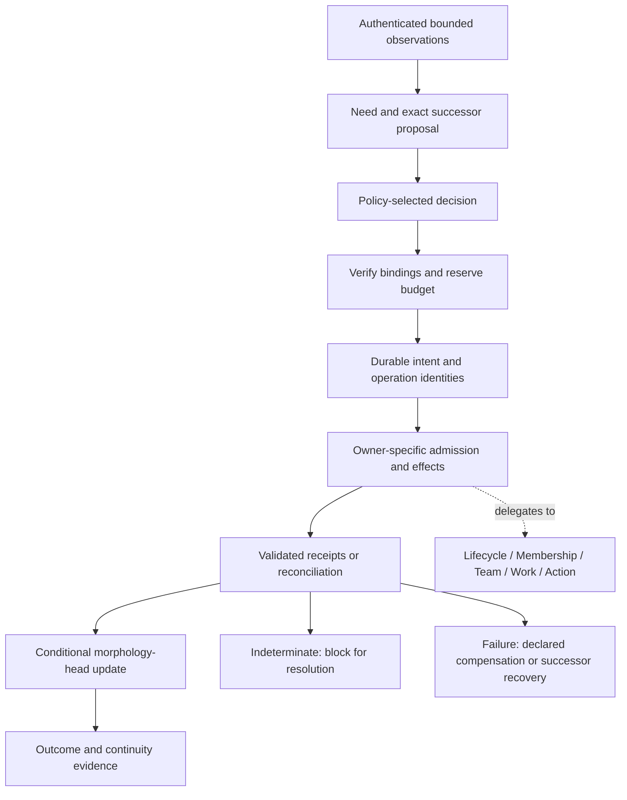

# Governed Agent Morphogenesis: Organizational Evolution with Bounded Authority and Causal Continuity

**Internal research draft v0.1 — 2026-09-13**  
**Authors and affiliations:** to be confirmed before circulation.  
**Reference implementation:** AgentPlat Agent Morphogenesis.  
**Status:** systems design and preliminary evidence; not a submission-ready empirical paper.

## Abstract

An agent collective may need to recruit specialists, create agents, transfer work, or retire participants as a mission changes. These transformations affect multiple independently authoritative subsystems, including identity, membership, work allocation, and external action enforcement. A proposed organizational improvement therefore creates a coordination problem: how can the change be authorized, enacted, and recovered without confusing organizational intent with execution authority? We present governed agent morphogenesis, a model of mission-scoped organizational transformation that binds a proposed successor to bounded observations, an exact decision, a resource envelope, and durable effect receipts. Its protocol preserves subsystem ownership, records intent before effects, reconciles ambiguous outcomes by stable operation identity, and distinguishes compensation from recovery after commitment. AgentPlat provides an open-source implementation using typed runtime contracts and replaceable persistence and execution adapters. We formulate conditional safety properties and describe existing local diagnostic evidence, including mixed source-conformance and service-backed checks. We also specify a comparative evaluation that has not yet been executed. The current evidence supports bounded implementation behavior; it does not establish organizational improvement, general exactly-once effects, or production readiness. The research contribution is the explicit composition of organizational change, authority, and recovery into a reviewable transition protocol.

**Keywords:** multi-agent systems; organizational adaptation; agent governance; durable execution; causal continuity; runtime reconfiguration.

## 1. Introduction

Consider a persistent agent collective preparing a technical proposal. Its initial members can research requirements and draft an answer, but a new requirement needs a specialist. The collective may recruit an existing agent or instantiate a temporary one, assign bounded work, incorporate its output, and eventually remove it. Even this small adaptation crosses several boundaries: a factory materializes an agent, membership admits an identity, a team incorporates a participant, work contracts allocate responsibility, and an action gateway determines which external effects are permitted.

Changing a list of agents does not coordinate those boundaries. A decision may expire before it is used. Two controllers may propose different successors from the same organization. A provider may perform an effect and lose its acknowledgement. Retirement may remove a resource while leaving actionable work behind. A resumed controller may encounter evidence that an operation was prepared without knowing whether it completed.

This paper asks: **under which explicit assumptions can an agent collective transform its operational organization while preserving bounded authority and a reconstructible account of ongoing work?** We use *morphogenesis* to denote mission-driven changes in operational form. The term is an engineering abstraction; it does not imply biological development, autonomous evolution of model weights, or an intrinsic tendency toward better organizations.

Organizational modeling, architectural adaptation, and compensation already provide important foundations. AgentPlat's proposed contribution is a concrete composition: each organizational transition connects observation, intent, authorization, owner-specific effects, recovery, and a versioned morphology head. The morphology controller coordinates these owners without replacing their authority.

The paper makes three contributions. First, it defines a compact transition model that separates an organizational projection from the state owned by individual subsystems. Second, it describes an implementation protocol and conditional safety arguments for admission, effect recovery, and successor selection. Third, it organizes preliminary evidence and a falsifiable evaluation plan around the distinction between protocol correctness and organizational utility.

The scope is deliberately bounded. The core protocol concerns recruitment, catalog-based instantiation, detachment, and retirement, with selected advanced operators illustrating composition. Strategy learning, profile synthesis, whole-collective evolution, and constitutional amendment are extensions rather than prerequisites for the claims made here. No new model training algorithm or universal organizational optimizer is proposed.

## 2. Related work and positioning

### 2.1 Explicit agent organizations

Agent organizations have long been modeled through roles, groups, missions, permissions, and obligations. The Moise project explicitly represents organization for agent reasoning and infrastructure enforcement. Dignum and Dignum relate organizational structure, objectives, and agent actions in a logical framework. These precedents mean that explicit organization and normative constraints are established research topics, not novelty claims of this paper. [Moise project](https://moise-lang.github.io/index-old.html); [Dignum and Dignum, 2012](https://arxiv.org/abs/1804.10817).

Our focus is the operational transition between organizations when the relevant authority and effects reside in distinct services. A full comparison with organizational reconfiguration and normative middleware remains necessary before claiming that this particular combination is novel. This draft establishes a candidate contribution, not a priority claim.

### 2.2 Adaptation in LLM-based collectives

AgentVerse dynamically adjusts group composition through its collaboration process. MorphAgent evolves profiles and roles using task feedback. G-Designer constructs task-conditioned communication topologies. These works motivate adaptive collectives and provide relevant comparisons for future utility experiments. [AgentVerse](https://arxiv.org/abs/2308.10848); [MorphAgent](https://arxiv.org/abs/2410.15048); [G-Designer](https://arxiv.org/abs/2410.11782).

We do not infer the absence of safety or recovery mechanisms from those papers' abstracts. Their relationship to the proposed protocol must be assessed at the mechanism and implementation level. Adaptation algorithms could supply candidate organizations to Morphogenesis, provided their proposals remain subject to the same admission rules. The initial causal evaluation therefore compares controlled implementations of the same adaptation policy; cross-framework benchmarking is a later experiment with additional integration confounders.

### 2.3 Architectural adaptation and durable effects

Rainbow uses architectural models and external adaptation mechanisms to support self-adaptive software. Morphogenesis similarly makes the managed structure explicit, while specializing the transition boundary to agent membership, work, and action authority. The adaptation-control pattern is inherited; the proposed contribution lies in how its agent-specific responsibilities compose. [Garlan et al., 2004](https://www.cs.cmu.edu/~able/publications/computer04/).

Sagas established compensation as a way to address partially executed long-lived transactions. Morphogenesis reuses this idea for declared reversible effects. It does not treat compensation as an atomic reversal of arbitrary external actions. Stable operation identities, durable journals, and compare-and-swap are engineering mechanisms used in the composition, not inventions claimed here. [Garcia-Molina and Salem, 1987](https://www.cs.princeton.edu/research/techreps/598).

Finally, causal ordering in distributed systems differs from a globally simultaneous observation. Our model records dependencies among observations, decisions, and receipts; it does not reconstruct a universal snapshot or establish that all relevant events have been observed. [Lamport, 1978](https://www.microsoft.com/en-us/research/publication/time-clocks-ordering-events-distributed-system/).

## 3. System model and assumptions

### 3.1 Organization and observation

Let a mission scope be \(s=(tenant,mission)\). For analysis, represent a morphology projection at epoch \(e\) as

\[
M_e=(s,e,V_e,R_e,T_e,W_e,H_e,P_e).
\]

Here \(V_e\) contains references to participants, \(R_e\) to roles and profiles, \(T_e\) to team or topology structure, \(W_e\) to work and continuity records, \(H_e\) to authenticated source heads, and \(P_e\) to policy. This tuple is paper notation, not an additional runtime schema. Each component is a bounded projection or reference to state owned elsewhere.

A source head binds its source identity, revision, digest, scope, authentication evidence, observation time, and expiry. Policy determines the sources required for a particular operator. A missing or stale required source prevents admission. Failure to discover an eligible candidate means absence from this bounded view, not absence from the entire network.

The narrow authoritative morphology head is

\[
h_e=(s,e,parentDigest,snapshotDigest,receiptDigest,revision).
\]

It records an accepted organizational successor. It is not the membership registry, the work scheduler, or an authorization database. Subsystem epochs may advance independently; use-time owner checks remain necessary after observation and decision.

### 3.2 Proposals, decisions, and effects

A proposal \(p\) binds the current morphology epoch and digest, a target projection, an operator plan, policy, budget envelope, expiry, and process definition. Its operator plan is a dependency graph \(G_p=(N_p,E_p)\). Each effectful node names its owning subsystem, stable operation identity, prerequisites, expected receipt, and any declared compensation.

A decision \(d\) approves the exact candidate under a configured route: authorized agent, authorized person, local policy, collective decision, or a composite. Agent membership or proposal authorship alone supplies no decision mandate. Human review is selected by policy rather than required by definition.

We distinguish transition admission from effect admission:

\[
Admit(p,d,h,t)=BindingMatch(p,d,h)\land CurrentRequiredSources(p,t)
\land ValidMandate(d,t)\land PolicyAllows(p)\land BudgetReserved(p,t).
\]

\[
MayApply(n,t)=AdmitStillApplicable(n,t)\land OwnerAuthorizes(n,t)
\land DependenciesReceipted(n).
\]

These are specification predicates. Their components are enforced across different boundaries, not by an atomic global check. Correct composition requires each owner to validate the relevant epoch, scope, mandate, and fence when admitting its own effect. A cached positive decision cannot eliminate that requirement.

### 3.3 Failure and trust model

The model allows controller crashes, retries, delayed or lost responses, concurrent proposals, stale observations, and temporary disconnection from required services. An effect may have completed even when its caller received no response. A requester may submit malformed or substituted plans or attempt to reuse expired decisions.

Conditional properties require the following deployment assumptions:

1. Owners authenticate requests and enforce their own scope, epoch, authorization, and resource checks. Protected effects cannot bypass these boundaries.
2. A stable operation identity refers to the same immutable operation. Owners either deduplicate and reconcile that identity reliably or report uncertainty without authorizing blind replay.
3. Durable stores provide the required conditional-write semantics. History rollback is detected using a separately trusted witness where that deployment profile requires one.
4. Digest bindings use canonical serialization and collision-resistant hashing. A digest alone provides neither authentication nor evidence truthfulness.
5. Time and expiry validation follow a documented deployment contract. Progress requires eventual availability of the owners needed for the transition; safety may require indefinite blocking.

Compromised authority owners, stolen signing keys, arbitrary provider dishonesty, unmediated tool use, and undetectable storage rollback are outside these conditional guarantees. The protocol does not establish semantic correctness of an LLM output or prove that a declared capability is useful.

## 4. Transition protocol

Figure 1 separates the control process from the owners that enact changes. It is a logical schematic, not a claim that all effects commit in a single transaction.



*Figure 1. Organizational intent becomes effects only through owning subsystems. The accepted morphology head links the resulting evidence; it does not confer the owners' permissions.*

### 4.1 Observe, propose, and authorize

The controller validates required source heads and records a bounded need. It selects an admissible target and compiles the operator plan. In the catalog lifecycle profile, the process definition comes from a closed catalog; a proposal cannot install arbitrary workflow code. Advanced operator compilation still uses a closed vocabulary and existing owners.

The proposal binds its source epoch and exact decision subject. A workflow gate may select an approved branch, but branch selection is not sufficient authorization. The controller resolves and validates the decision before preparing effects. The advanced governed entry point additionally binds the compiled plan to a separately issued execution authorization and fence.

Budget reservation accounts for concurrent proposals before resource materialization. It is distinct from observed workflow usage and from budgets enforced by downstream owners. Reservation failure rejects or delays the transition; a reserved global envelope cannot widen an individual work or action grant.

### 4.2 Prepare, enact, and reconcile

Before each external operation, the controller persists immutable intent and its stable identity. On restart, it asks the owner to reconcile any prepared operation whose result is unknown. A confirmed result can supply a validated receipt. A definitely absent effect may be attempted only when the owner contract makes that determination safe against delayed execution. An indeterminate result blocks advancement.

The protocol therefore does not equate a timeout with a failed effect. Nor does an application-side journal itself ensure exactly-once provider behavior. Those properties depend on the effect owner's implementation and the external system it controls.

An abstract execution rule is:

```text
for each ready effect in the approved plan:
    persist immutable intent under its stable operation identity
    validate current owner admission requirements
    resolve any previously prepared attempt with the owner
    if its outcome remains indeterminate: stop advancement
    if safely unapplied: request the effect under the same identity
    validate and persist the owner's result receipt
attempt the morphology-head update against the bound predecessor
```

This is explanatory pseudocode. It does not replace the distinct V1 and V2 runtime state machines, nor imply that an owner call and a journal write share a transaction.

### 4.3 Commit and recovery boundaries

The morphology store accepts a successor using revision-and-digest compare-and-swap. A competing update invalidates the expected predecessor; it does not authorize silently rebasing an old decision onto the new state.

Owner effects and morphology commitment are separate events. In the inspected V1 implementation, successor Team activation precedes morphology commitment. Consequently, a controller may recover with an activated Team and an unadvanced morphology head. This intermediate condition must be reconciled from owner receipts. A single winning morphology head is not sufficient evidence that all losing proposals had no material effects.

Declared reversible effects may be compensated before commitment. The advanced profile journals compensation separately and processes applied steps in reverse order. Irreversible effects and unresolved outcomes require explicit handling; they cannot be erased by restoring an old projection. After commitment, recovery is represented as a successor transition rather than an atomic rollback of history.

### 4.4 Work continuity and retirement

Detachment and retirement require a continuity checkpoint and fencing of work/action authority before removing or terminating the resource. The checkpoint identifies useful work and its provenance; successor work allocation remains owned by the work subsystem. Material availability, membership, team participation, and permission to act are distinct states.

For the specialist example, the transition records why the agent was added, which profile and decision authorized the plan, which work it received, and which receipts established its later removal. If a retirement acknowledgement is lost, reconciliation uses the original operation identity. Causal continuity means these dependencies remain reconstructible; it does not mean that every mission succeeds or that every generated artifact remains semantically useful.

## 5. Conditional properties and proof obligations

The following arguments apply to the abstract model under Section 3's assumptions. They are proof sketches and implementation obligations, not machine-checked theorems about the entire repository.

**P1 — Owner-bounded authority.** Every admitted protected effect has a current grant from its owner. Assuming complete mediation and correct owner validation, induction over effect admissions establishes this property: coordination records create no alternative admission path. An implementation that invokes an unprotected provider bypasses the premise. This property does not imply that an authorized policy is ethically appropriate or that authority can never be expanded through a legitimate owner decision.

**P2 — One accepted successor per predecessor revision.** If all writers use the same authoritative, linearizable conditional store and the expected revision/digest pair, at most one distinct successor can consume that pair. The first successful write changes the comparison value; a competing write cannot succeed against it. This is a local head property. Restored stores, disconnected authority replicas, and material side effects require additional mechanisms and are not covered by CAS alone.

**P3 — No blind replay of unresolved effects.** If every effect is preceded by durable intent, recovery inspects that intent, and indeterminate owner results block execution, controller recovery cannot intentionally resubmit the unresolved operation as a fresh operation. Preventing duplicate material effects additionally requires correct owner deduplication and reconciliation. A delayed original request racing with an incorrect “absent” answer is a counterexample when those assumptions fail.

**P4 — Terminal removal follows fencing.** If the terminal boundary requires validated checkpoint and fence receipts and the owners enforce those fences at action admission, resource removal follows the declared continuity and revocation steps. Already admitted in-flight actions require the owner's draining contract; fence issuance does not retroactively undo them.

**P5 — Accepted lineage is evidence-linked.** If the head accepts only validated receipt bindings and predecessor references, each accepted successor has a reconstructible dependency path to its proposal and decision. Hash linkage detects some inconsistencies but does not prove that an external receipt is truthful, complete, or durably retrievable. Evidence retention is a separate operational obligation.

Liveness is intentionally weaker than safety. An unavailable owner, expired decision, lost budget reservation, or indeterminate effect can block progress. A meaningful evaluation must count those blocked missions and their recovery cost instead of treating all refusals as successful adaptation.

## 6. Reference implementation

AgentPlat implements Morphogenesis as an opt-in subpath of AgentPlat Collective Runtime. Domain contracts represent observations, proposals, decisions, execution records, and receipts. Governed Durable Workflows owns process execution. The Collective Host PostgreSQL adapter owns durable morphology storage. Agent Rooms and Agent Mesh expose projections without acquiring execution authority. The package architecture preserves existing lifecycle, Membership, Team, Work, Trust, and Action boundaries. See the [architecture](../../architecture.md) and [ADR 0046](../../adr/0046-agent-morphogenesis.md).

The paper's core scope corresponds to the [V1 specification](../../specification/agent-morphogenesis-v1.md), with compiled operators and compensation from [V2](../../specification/agent-morphogenesis-v2.md). Selected source inspection confirms explicit plan/decision matching and authorization expiry checks in the governed V2 entry point, prepared-operation reconciliation in the V1 execution runtime, and an indeterminate compensation state in V2. These observations establish source structure, not deployment-wide enforcement.

The implementation uses content-minimized control records: identifiers, enums, counters, and digests rather than raw prompts, model outputs, or private keys. Such records can still expose metadata and correlations. Content minimization is not a general privacy proof.

The source inspected for this draft was commit `12fd870bb858476fc0f221d13b6ee1f6b1ab3e39`. Historical experiments below use other source bindings. They must not be relabeled as tests of this commit. Morphogenesis remains outside the frozen Collective Capability Baseline V1 denominator.

## 7. Preliminary evidence and its boundaries

This section reports existing artifacts; no experiment was executed to produce this draft. The evidence classes and source bindings are intentionally kept separate.

| Collection | Recorded observation | Evidentiary limit |
| --- | --- | --- |
| Beta 1 local-profile release | The report lists 18 scenarios, with both diagnostic operational passes and source-conformance outcomes | Mixed classes; not 18 service-backed crash experiments |
| Local diagnostics, 2026-09-09 | The narrative records 76 runtime tests and 1,000 deterministic in-memory runs, plus local service probes | The counts are reported from the narrative; all underlying receipts were not reverified for this draft |
| Local supervisor follow-up | Existing verification JSON records a different supervisor process, 174 ms resume time, and 144,676 ms total duration | One controlled local stop/resume; no host-loss or arbitrary-kill result |
| V1–V8 staging registration | Eight scenarios are described in a registration with execution disabled | Experimental design only; no result |

The [Beta 1 report](../agent-morphogenesis-beta1-release-v1/operational-validation-report.md) binds source commit `763b0429bfdb4d931db1ddd605f6ea89ff271767`. It explicitly excludes profile synthesis, recursive creation, and team split/merge/federation. Several crash and concurrency rows are classified as source conformance. The report therefore cannot support a blanket distributed operational claim.

The [September 9 diagnostic account](../agent-morphogenesis-local-validation-2026-09-09.md) distinguishes the initial mixed workspace source binding from a subsequent supervisor snapshot, `51529cfa8d4b9b482af366cdbd75e9ddcca3bf77`. The follow-up account reports 120 PostgreSQL–Temporal iterations and six local Mesh cycles, with no recorded duplicate effects, unauthorized activations, lost receipts, or morphology-head forks. It also retains an earlier failed setup attempt. The separate verification JSON was inspected for this draft and agrees on the reported resume time and duration; its hash-chain verification flags are prior verifier output, not a new independent verification performed here.

These observations demonstrate the existence of bounded diagnostics and recovery artifacts. They do not estimate the probability of real-world failures, establish long-duration stability, or measure the effect of reorganization on task quality. The 1,000 in-memory runs are not persistent distributed executions. The controlled supervisor restart is not persistent server or host-loss recovery. The timing values are single recorded observations, not latency distributions or performance guarantees.

The [staging preregistration](../agent-morphogenesis-v1-v8-staging-preregistration-v1.md) is likewise separate from results. Neither a configured scenario nor a passing source test supplies evidence that its deployment experiment has occurred. A publication-quality empirical section requires a frozen source snapshot, accessible artifact bundle, and independent validation of the specific claims retained.

## 8. Proposed comparative evaluation — not executed

### 8.1 Research questions and conditions

**RQ1:** Does the composed protocol prevent the declared violations under controlled failure schedules, and which mechanisms are responsible? **RQ2:** What latency, resource cost, and blocked-progress overhead does governance introduce? **RQ3:** Under changing task requirements, when does organizational adaptation improve mission outcomes at a fixed resource budget?

Use three primary conditions: a fixed organization; an adaptive organization with the same proposal policy but minimal coordination controls; and the governed adaptive organization. Keep initial capabilities, available specialists, model/version, tools, task instances, and resource ceilings matched. All conditions retain sandbox isolation. The minimal-control condition runs only against instrumented test effects and is not a deployable recommendation.

For RQ1, add one-mechanism-at-a-time ablations: stale-decision binding checks, operation reconciliation, morphology-head CAS, and fencing prerequisites. Preserve other controls. A null ablation effect may reveal a masked fault, redundant protection, or a weak workload; it must not automatically be described as proof that the mechanism is unnecessary.

### 8.2 Workloads and fault injection

The first workload is a deterministic mission graph with independently scored artifacts and explicit capability requirements. During execution, introduce a missing skill, agent unavailability, and a later reduction in demand. This tests addition, work continuity, and removal without relying on subjective model judgments. A later LLM-backed workload can use the same transition envelope, but requires a separate model and budget registration.

| Scenario | Injection point | Independent observable |
| --- | --- | --- |
| Capability change | New task requires unavailable skill | Completion, adaptation delay, incremental cost |
| Lost effect response | Owner commits before acknowledgement | Material-effect count by operation identity |
| Competing successors | Two plans share a predecessor | Accepted heads and effects from losing plans |
| Stale approval | Owner epoch changes after decision | Rejected or admitted protected effects |
| Removal under load | Agent has pending or in-flight work | Fence enforcement, drain result, recoverable artifacts |
| Controller restart | Crash before/after selected journal boundaries | Recovery time, unresolved operations, duplicates |
| Owner unavailability | Reconciliation endpoint is unreachable | Blocked duration and premature advancement |

Instrument effects at the owning sink, not only in controller logs. Record authorization violations as admissions that lack a valid owner grant at the relevant admission event. Count duplicate effects against declared operation semantics. Preserve receipts for losing proposals and compensated operations so that head correctness does not conceal external damage.

### 8.3 Measurements and analysis

Primary correctness outcomes are unauthorized admissions, duplicate material effects, distinct accepted successors for the same predecessor, terminal removal without required evidence, and incomplete terminal receipt chains. Any observed prohibited outcome falsifies the corresponding bounded conformance claim. Zero observed violations does not prove their general absence.

For utility, measure mission success against an independent task oracle, completed useful work, and total resource cost. Define continuity as the fraction of previously accepted work artifacts that remain addressable and valid for the successor's task dependencies; this proposed metric is distinct from historical receipt fields named “continuity.” Report recovery latency, blocked mission fraction, reconfiguration count, tokens, and provider cost separately. Retries and governance overhead count against the same total budget.

An initial engineering pilot should assess harness correctness and runtime variance. After that pilot, freeze task instances, fault schedules, sample sizes, exclusion rules, and analysis in a new registration before confirmatory runs. A provisional design uses 30 independently seeded mission instances per workload/fault cell, paired across conditions; this is a planning value, not a power calculation. Repeated observations within one mission are not independent samples.

Report paired outcome differences with uncertainty intervals, per-scenario raw counts, and median and tail latency when enough observations exist. Include timeouts, blocked transitions, setup failures, and budget exhaustion. Predeclare the timeout horizon; treat unresolved recovery times as censored rather than silently dropping them. A descriptive zero-event upper bound is meaningful only under explicitly justified sampling assumptions, not across correlated retries or deterministic replays.

The fixed organization may perform better when no adaptation is needed, and governance may consume enough resources to reduce task success. Those outcomes would delimit the method's usefulness. RQ1 can succeed while RQ3 fails; the paper must not substitute conformance for utility.

## 9. Limitations and future work

The current novelty assessment is selective. Organizational middleware, runtime verification, and distributed reconfiguration warrant a deeper mechanism-level comparison. The abstract predicates also need a precise refinement mapping to runtime transitions and negative tests covering cross-owner interleavings. There is no end-to-end formal proof in this version.

The trusted computing base is substantial: identity issuers, policy configuration, effect owners, storage semantics, expiry handling, and deployment wiring. A correct library can be composed incorrectly. Resource reservation also cannot bound activity that bypasses the registered resource authorities. Local multi-process tests do not model independent physical failure domains or long-lived production traffic.

Causal evidence does not establish semantic mission fidelity. A formally authorized organizational change can be unhelpful, expensive, or based on mistaken capability evidence. Evaluating those outcomes requires task-level ground truth and matched baselines. Human or quorum decisions introduce additional costs and failure modes, including correlated reviewers and inadequate mandates.

Later AgentPlat versions explore strategy adaptation, synthesized profiles, agent genesis, whole-collective evolution, and constitutional continuity. These extensions raise a longitudinal question: can individually admissible changes accumulate into mission drift or excessive authority concentration? That question motivates future work but is not answered by the V1/V2 evidence here. Finite model exploration, when used, must report its bounds and incomplete outcomes rather than claiming unrestricted proof.

## 10. Conclusion

Governed agent morphogenesis treats organizational change as a coordinated transition among independently authoritative subsystems. Its central separation is between proposing a new organization, authorizing a bounded plan, and admitting each material effect. Durable intent, owner receipts, conditional successor selection, and explicit recovery make that separation inspectable across failures. AgentPlat supplies a reference implementation and bounded local diagnostic artifacts. Comparative experiments remain necessary to determine whether the protocol delivers the expected safety behavior across the declared failure model and when its cost is justified by improved mission outcomes.

## References

1. AgentPlat contributors. *AgentPlat*. Source repository; cite the exact experiment commit. [Repository](https://github.com/Agentplat/agentplat). The source inspected for this draft and historical experiment commits are distinguished in Sections 6–7.
2. Virginia Dignum and Frank Dignum. 2012. *A Logic of Agent Organizations*. Logic Journal of the IGPL 20(1), 283–316. [DOI](https://doi.org/10.1093/jigpal/jzr041); [author manuscript deposited in 2018](https://arxiv.org/abs/1804.10817).
3. Moise project. *The Moise Organisation Oriented Programming Framework*. Project documentation, accessed 2026-09-13. [Project source](https://moise-lang.github.io/index-old.html).
4. Weize Chen et al. 2023. *AgentVerse: Facilitating Multi-Agent Collaboration and Exploring Emergent Behaviors*. arXiv:2308.10848. [Preprint record](https://arxiv.org/abs/2308.10848).
5. Siyuan Lu, Jiaqi Shao, Bing Luo, and Tao Lin. 2024. *MorphAgent: Empowering Agents through Self-Evolving Profiles and Decentralized Collaboration*. arXiv:2410.15048. [Preprint record](https://arxiv.org/abs/2410.15048).
6. Guibin Zhang et al. 2024. *G-Designer: Architecting Multi-agent Communication Topologies via Graph Neural Networks*. arXiv:2410.11782. [Preprint record](https://arxiv.org/abs/2410.11782).
7. David Garlan, Shang-Wen Cheng, An-Cheng Huang, Bradley Schmerl, and Peter Steenkiste. 2004. *Rainbow: Architecture-Based Self Adaptation with Reusable Infrastructure*. IEEE Computer 37(10). [Author publication page](https://www.cs.cmu.edu/~able/publications/computer04/).
8. Hector Garcia-Molina and Kenneth Salem. 1987. *Sagas*. Princeton University technical report TR-070-87. [Institutional record](https://www.cs.princeton.edu/research/techreps/598).
9. Leslie Lamport. 1978. *Time, Clocks, and the Ordering of Events in a Distributed System*. Communications of the ACM 21(7), 558–565. [Author publication page](https://www.microsoft.com/en-us/research/publication/time-clocks-ordering-events-distributed-system/).

The preprint years identify initial arXiv records; camera-ready bibliography preparation must pin the exact versions read and normalize publication venues. Repository evidence references are linked at their point of use and mapped in the accompanying evidence matrix.
