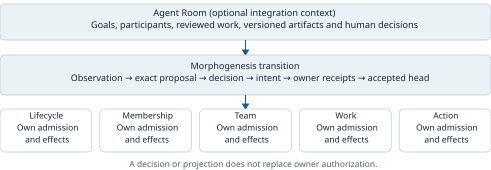
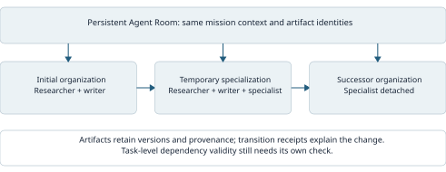
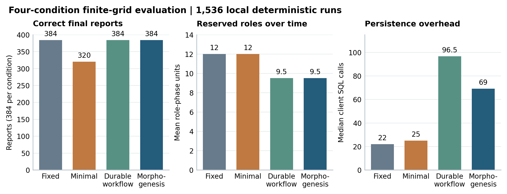

# Governed Agent Morphogenesis: Runtime Organizational Reconfiguration with Bounded Authority and Causal Continuity

**Research preprint v0.4 - 2026-09-19**  
**Douglas Rodríguez**  
**Reference implementation:** AgentPlat Agent Morphogenesis.  
**Status:** systems protocol with reproducible local boundary, integration and finite-grid evaluations.

## Abstract

Agent collectives may need to recruit specialists, transfer work, and retire participants while a mission is in progress. Each change can cross independently authoritative lifecycle, membership, work, and action services. We present governed agent morphogenesis, a transition protocol that binds an organizational proposal to an exact decision, bounded resources, owner-specific effects, and a reconstructible successor history. Agent Rooms provide a persistent collaboration context for work artifacts and human decisions as participants change. We give conditional safety arguments, map their obligations to AgentPlat's reference implementation, and release three complementary local evaluations. Boundary and PostgreSQL integration experiments distinguish a single accepted morphology successor from residual owner effects and a nonterminal losing execution. A separately frozen finite-grid study evaluates 1,536 deterministic missions across fixed organization, minimal adaptation, durable-workflow adaptation, and Morphogenesis. Fixed organization and both durable adaptive conditions produce 384 correct final reports each; minimal adaptation produces 320 after duplicate reservations exhaust some budgets. The two durable adaptive conditions have equal task outcomes and role-reservation use, with different persistence overhead. These results support a bounded systems composition, not unique recovery superiority or LLM organizational intelligence. The protocol makes organizational change inspectable while preserving effect-owner authority.

**Keywords:** multi-agent systems; organizational adaptation; agent governance; durable execution; causal continuity; runtime reconfiguration.

## 1. Introduction

Consider an Agent Room in which a person and an agent collective prepare a technical proposal. Its initial members can research requirements and draft an answer, but a new requirement needs a specialist. The collective may recruit an existing agent or instantiate a temporary one, assign bounded work, incorporate its output, and eventually remove it. Even this small adaptation crosses several boundaries: a factory materializes an agent, membership admits an identity, a team incorporates a participant, work contracts allocate responsibility, and an action gateway determines which external effects are permitted.

Changing a list of agents does not coordinate those boundaries. A decision may expire before it is used. Two controllers may propose different successors from the same organization. A provider may perform an effect and lose its acknowledgement. Retirement may remove a resource while leaving actionable work behind. A resumed controller may encounter evidence that an operation was prepared without knowing whether it completed.

This paper asks: **under which explicit assumptions can an agent collective transform its operational organization while preserving bounded authority and a reconstructible account of ongoing work?** We use *morphogenesis* to denote mission-driven changes in operational form. The term is an engineering abstraction; it does not imply biological development, autonomous evolution of model weights, or an intrinsic tendency toward better organizations.

Organizational modeling, architectural adaptation, and compensation already provide important foundations. AgentPlat's proposed contribution is a concrete composition: each organizational transition connects observation, intent, authorization, owner-specific effects, recovery, and a versioned morphology head. The morphology controller coordinates these owners without replacing their authority.

The paper makes three contributions: (1) a transition model separating organizational intent, decision authority, and effect ownership; (2) a recoverable protocol with explicit assumptions and implementation obligations for successor selection, retirement, and evidence continuity; and (3) an open-source reference mapping and reproducible boundary, integration and four-condition mission evaluations, including a counterexample to interpreting head consistency as atomic reconfiguration. Protocol safety and organizational utility are evaluated as separate questions.

The scope is deliberately bounded. The core protocol concerns recruitment, catalog-based instantiation, detachment, and retirement, with selected advanced operators illustrating composition. Strategy learning, profile synthesis, whole-collective evolution, and constitutional amendment are extensions rather than prerequisites for the claims made here. No new model training algorithm or universal organizational optimizer is proposed.

## 2. Related work and positioning

### 2.1 Explicit agent organizations

Agent organizations have long been modeled through roles, groups, missions, permissions, and obligations. The Moise project explicitly represents organization for agent reasoning and infrastructure enforcement. Dignum and Dignum relate organizational structure, objectives, and agent actions in a logical framework. These precedents mean that explicit organization and normative constraints are established research topics, not novelty claims of this paper. [Moise project](https://moise-lang.github.io/index-old.html); [Dignum and Dignum, 2012](https://arxiv.org/abs/1804.10817).

Runtime reorganization itself is also established. Sorici et al. describe a JaCaMo ReorgBoard, an implementation plan, and organizational rules for coordinating reorganization. Their plan separates stopping an organizational entity, changing its specification, and starting its successor [10, Sections 3-4]. ParaMoise represents reorganization through workflows and read/write locks over the affected parts of an organization; compatible reorganizations can proceed concurrently [11, Section 3.3]. These are direct predecessors, not merely background on static roles. [JaCaMo reorganization](https://www.gauthier-picard.info/publications/sorici12itmas.pdf); [ParaMoise](https://www.ifaamas.org/Proceedings/aamas2013/docs/p1029.pdf).

Our focus is a particular cross-service contract: bind an exact organizational decision to owner-admitted effects, preserve their identities across uncertain outcomes, and record accepted lineage without treating that lineage as a global transaction. The comparison below identifies mechanisms described in the consulted sources. It does not claim their implementations lack unreported controls.

| Precedent | Mechanism established in the source | Boundary addressed here |
| --- | --- | --- |
| JaCaMo reorganization [10] | Norm-regulated reorganization and coordinated implementation plans | Stable effect identity and ambiguous outcomes across independently authoritative services |
| ParaMoise [11] | Workflow-based reorganization and scoped read/write exclusion | Receipt-linked successor commitment when owner effects are not globally atomic |
| Sagas [8] | Compensating partially completed long-lived transactions | Organizational admission, effect authority and post-commit lineage |
| MorphAgent [5] | Feedback-driven profile adaptation | How a selected change is authorized and recovered |

Agent Rooms [12] supplies a complementary abstraction: a persistent collaboration container for human and agent work. Morphogenesis specifies transitions of the organization operating in that context. We do not claim to originate organizational adaptation, normative governance, durable execution, or artifact-oriented collaboration.

### 2.2 Adaptation in LLM-based collectives

AgentVerse dynamically adjusts group composition through its collaboration process. MorphAgent evolves profiles and roles using task feedback. G-Designer constructs task-conditioned communication topologies. These works motivate adaptive collectives and provide relevant comparisons for future utility experiments. [AgentVerse](https://arxiv.org/abs/2308.10848); [MorphAgent v2](https://arxiv.org/abs/2410.15048v2); [G-Designer](https://arxiv.org/abs/2410.11782).

The detailed profile-update mechanism in MorphAgent v2 (Section 3) informs the comparison above; a profile proposal does not itself specify how heterogeneous effect owners recover an interrupted change. This is a scope distinction, not evidence that another implementation lacks recovery controls. Adaptation algorithms could supply candidate organizations to Morphogenesis, provided their proposals remain subject to the same admission rules. The mission study holds the adaptive proposal schedule constant. Cross-framework benchmarking would introduce additional integration confounders and is not performed here.

### 2.3 Architectural adaptation and durable effects

Rainbow uses architectural models and external adaptation mechanisms to support self-adaptive software. Morphogenesis similarly makes the managed structure explicit, while specializing the transition boundary to agent membership, work, and action authority. The adaptation-control pattern is inherited; the proposed contribution lies in how its agent-specific responsibilities compose. [Garlan et al., 2004](https://www.cs.cmu.edu/~able/publications/computer04/).

Sagas established compensation as a way to address partially executed long-lived transactions. Morphogenesis reuses this idea for declared reversible effects. It does not treat compensation as an atomic reversal of arbitrary external actions. Stable operation identities, durable journals, and compare-and-swap are engineering mechanisms used in the composition, not inventions claimed here. [Garcia-Molina and Salem, 1987](https://www.cs.princeton.edu/research/techreps/598).

Finally, causal ordering in distributed systems differs from a globally simultaneous observation. Our model records dependencies among observations, decisions, and receipts; it does not reconstruct a universal snapshot or establish that all relevant events have been observed. [Lamport, 1978](https://www.microsoft.com/en-us/research/publication/time-clocks-ordering-events-distributed-system/).

## 3. System model and assumptions

### 3.1 Organization and observation

Let a mission scope be \(s=(tenant,mission)\). For analysis, represent a morphology projection at epoch \(e\) as

\[
M_e=(s,e,V_e,R_e,T_e,W_e,H_e,P_e).
\]

Here \(V_e\) contains references to participants, \(R_e\) to roles and profiles, \(T_e\) to team or topology structure, \(W_e\) to work and continuity records, \(H_e\) to authenticated source heads, and \(P_e\) to policy. This tuple is paper notation, not an additional runtime schema. Each component is a bounded projection or reference to state owned elsewhere.

A source head binds its source identity, revision, digest, scope, authentication evidence, observation time, and expiry. Policy determines the sources required for a particular operator. A missing or stale required source prevents admission. Failure to discover an eligible candidate means absence from this bounded view, not absence from the entire network.

The narrow authoritative morphology head is

\[
h_e=(s,e,parentDigest,snapshotDigest,receiptDigest,revision).
\]

It records an accepted organizational successor. It is not the membership registry, the work scheduler, or an authorization database. Subsystem epochs may advance independently; use-time owner checks remain necessary after observation and decision.

### 3.2 Proposals, decisions, and effects

A proposal \(p\) binds the current morphology epoch and digest, a target projection, an operator plan, policy, budget envelope, expiry, and process definition. Its operator plan is a dependency graph \(G_p=(N_p,E_p)\). Each effectful node names its owning subsystem, stable operation identity, prerequisites, expected receipt, and any declared compensation.

A decision \(d\) approves the exact candidate under a configured route: authorized agent, authorized person, local policy, collective decision, or a composite. Agent membership or proposal authorship alone supplies no decision mandate. Human review is selected by policy rather than required by definition.

We distinguish transition admission from effect admission:

\[
Admit(p,d,h,t)=BindingMatch(p,d,h)\land CurrentRequiredSources(p,t)
\land ValidMandate(d,t)\land PolicyAllows(p)\land BudgetReserved(p,t).
\]

\[
MayApply(n,t)=AdmitStillApplicable(n,t)\land OwnerAuthorizes(n,t)
\land DependenciesReceipted(n).
\]

These are specification predicates. Their components are enforced across different boundaries, not by an atomic global check. Correct composition requires each owner to validate the relevant epoch, scope, mandate, and fence when admitting its own effect. A cached positive decision cannot eliminate that requirement.

### 3.3 Failure and trust model

The model allows controller crashes, retries, delayed or lost responses, concurrent proposals, stale observations, and temporary disconnection from required services. An effect may have completed even when its caller received no response. A requester may submit malformed or substituted plans or attempt to reuse expired decisions.

Conditional properties require the following deployment assumptions:

1. Owners authenticate requests and enforce their own scope, epoch, authorization, and resource checks. Protected effects cannot bypass these boundaries.
2. A stable operation identity refers to the same immutable operation. Owners either deduplicate and reconcile that identity reliably or report uncertainty without authorizing blind replay.
3. Durable stores provide the required conditional-write semantics. History rollback is detected using a separately trusted witness where that deployment profile requires one.
4. Digest bindings use canonical serialization and collision-resistant hashing. A digest alone provides neither authentication nor evidence truthfulness.
5. Time and expiry validation follow a documented deployment contract. Progress requires eventual availability of the owners needed for the transition; safety may require indefinite blocking.

Compromised authority owners, stolen signing keys, arbitrary provider dishonesty, unmediated tool use, and undetectable storage rollback are outside these conditional guarantees. The protocol does not establish semantic correctness of an LLM output or prove that a declared capability is useful.

## 4. Transition protocol

Figure 1 separates persistent collaboration, organizational transition, and effect authority. The arrows denote data and control dependencies, not a global transaction.



*Figure 1. Agent Room preserves collaboration records. Morphogenesis binds the proposed change and its evidence. Lifecycle, Membership, Team, Work and Action retain their own admission boundaries. An artifact projection grants no operational authority.*

### 4.1 Observe, propose, and authorize

The controller validates required source heads and records a bounded need. It selects an admissible target and compiles the operator plan. In the catalog lifecycle profile, the process definition comes from a closed catalog; a proposal cannot install arbitrary workflow code. Advanced operator compilation still uses a closed vocabulary and existing owners.

The proposal binds its source epoch and exact decision subject. A workflow gate may select an approved branch, but branch selection is not sufficient authorization. The controller resolves and validates the decision before preparing effects. The advanced governed entry point additionally binds the compiled plan to a separately issued execution authorization and fence.

Budget reservation accounts for concurrent proposals before resource materialization. It is distinct from observed workflow usage and from budgets enforced by downstream owners. Reservation failure rejects or delays the transition; a reserved global envelope cannot widen an individual work or action grant.

### 4.2 Prepare, enact, and reconcile

Before each external operation, the controller persists immutable intent and its stable identity. On restart, it asks the owner to reconcile any prepared operation whose result is unknown. A confirmed result can supply a validated receipt. A definitely absent effect may be attempted only when the owner contract makes that determination safe against delayed execution. An indeterminate result blocks advancement.

The protocol therefore does not equate a timeout with a failed effect. Nor does an application-side journal itself ensure exactly-once provider behavior. Those properties depend on the effect owner's implementation and the external system it controls.

An abstract execution rule is:

```text
for each ready effect in the approved plan:
    persist immutable intent under its stable operation identity
    validate current owner admission requirements
    resolve any previously prepared attempt with the owner
    if its outcome remains indeterminate: stop advancement
    if safely unapplied: request the effect under the same identity
    validate and persist the owner's result receipt
attempt the morphology-head update against the bound predecessor
```

This is explanatory pseudocode. It does not replace the distinct V1 and V2 runtime state machines, nor imply that an owner call and a journal write share a transaction.

### 4.3 Commit and recovery boundaries

The morphology store accepts a successor using revision-and-digest compare-and-swap. A competing update invalidates the expected predecessor; it does not authorize silently rebasing an old decision onto the new state.

Owner effects and morphology commitment are separate events. In the inspected V1 implementation, successor Team activation precedes morphology commitment. Consequently, a controller may recover with an activated Team and an unadvanced morphology head. This intermediate condition must be reconciled from owner receipts. A single winning morphology head is not sufficient evidence that all losing proposals had no material effects.

Declared reversible effects may be compensated before commitment. The advanced profile journals compensation separately and processes applied steps in reverse order. Irreversible effects and unresolved outcomes require explicit handling; they cannot be erased by restoring an old projection. After commitment, recovery is represented as a successor transition rather than an atomic rollback of history.

### 4.4 A losing proposal can leave an effect

Consider two proposals A and B bound to morphology epoch e. Each obtains an owner receipt for Team activation before either updates the morphology head. A commits first. B's update is rejected as stale, but B's owner receipt still exists. Section 7 first isolates this boundary with synthetic effects, then exercises two approved proposals through the reference Team adapter, Work reducers and PostgreSQL stores.

The correct observable is therefore a pair: accepted successors and material effects from losing proposals. Reporting only one accepted successor hides the second quantity. A deployment must specify whether pre-commit Team activation can admit useful work, which owner fences constrain it, and how losing effects are reconciled or compensated. This paper does not assert that V1 automatically compensates every such effect. The integrated experiment uses two explicit local Work grants; it does not bypass those owners. Cleanup cancels the losing Team and releases its Work contract, but the V1 execution remains in `committing_morphology`. This distinction separates cleanup of effects from termination of the coordinating state machine.


*Figure 2. Left: durable intent and an owner receipt survive worker termination; reconciliation recovers the same operation. Right: two owner effects may precede a single accepted head. Compensation or successor recovery is a separate obligation.*

### 4.5 Work continuity and retirement

Detachment and retirement require a continuity checkpoint and fencing of work/action authority before removing or terminating the resource. The checkpoint identifies useful work and its provenance; successor work allocation remains owned by the work subsystem. Material availability, membership, team participation, and permission to act are distinct states.

For the specialist example, the transition records why the agent was added, which profile and decision authorized the plan, which work it received, and which receipts established its later removal. If a retirement acknowledgement is lost, reconciliation uses the original operation identity. Causal continuity means these dependencies remain reconstructible; it does not mean that every mission succeeds or that every generated artifact remains semantically useful.

### 4.6 Three meanings of continuity

For an accepted transition, define evidence continuity as the ability to resolve a typed dependency path from predecessor and observation through proposal, decision, intent, owner receipts, and successor. Every edge must have matching scope and immutable subject bindings. Hash agreement alone does not establish source authenticity or retention.

Work continuity concerns artifacts: for a nonempty set of predecessor artifacts required by successor tasks, measure the fraction still addressable at the required version with valid dependencies. An empty required set is reported as not applicable, not perfect continuity. Semantic validity needs a task oracle; existence of an artifact is insufficient.

Mission continuity concerns purpose and constraints across multiple transitions. It is outside the core evaluation. Here, causal continuity denotes execution provenance and dependencies, not a causal estimate of performance improvement.



*Figure 3. The Room and artifact identities can persist while participants change. An accepted receipt explains a transition; artifact dependency checks determine whether prior work remains useful. Neither property alone proves mission fidelity.*

## 5. Conditional properties and proof obligations

The following arguments apply to the abstract model under Section 3's assumptions. They are proof sketches and implementation obligations, not machine-checked theorems about the entire repository.

**P1 — Owner-bounded authority.** Every admitted protected effect has a current grant from its owner. Assuming complete mediation and correct owner validation, induction over effect admissions establishes this property: coordination records create no alternative admission path. An implementation that invokes an unprotected provider bypasses the premise. This property does not imply that an authorized policy is ethically appropriate or that authority can never be expanded through a legitimate owner decision.

**P2 — One accepted successor per predecessor revision.** If all writers use the same authoritative, linearizable conditional store and the expected revision/digest pair, at most one distinct successor can consume that pair. The first successful write changes the comparison value; a competing write cannot succeed against it. This is a local head property. Restored stores, disconnected authority replicas, and material side effects require additional mechanisms and are not covered by CAS alone.

**P3 — No blind replay of unresolved effects.** If every effect is preceded by durable intent, recovery inspects that intent, and indeterminate owner results block execution, controller recovery cannot intentionally resubmit the unresolved operation as a fresh operation. Preventing duplicate material effects additionally requires correct owner deduplication and reconciliation. A delayed original request racing with an incorrect “absent” answer is a counterexample when those assumptions fail.

**P4 — Terminal removal follows fencing.** If the terminal boundary requires validated checkpoint and fence receipts and the owners enforce those fences at action admission, resource removal follows the declared continuity and revocation steps. Already admitted in-flight actions require the owner's draining contract; fence issuance does not retroactively undo them.

**P5 — Accepted lineage is evidence-linked.** If the head accepts only validated receipt bindings and predecessor references, each accepted successor has a reconstructible dependency path to its proposal and decision. Hash linkage detects some inconsistencies but does not prove that an external receipt is truthful, complete, or durably retrievable. Evidence retention is a separate operational obligation.

| Property | Runtime obligation | External premise and counterexample |
| --- | --- | --- |
| P1: authority | Route protected effects through their owners | Correct use-time grants; a bypassing tool call defeats mediation |
| P2: successor | Compare the expected predecessor in the head store | Linearizable store; effects from a losing proposal remain possible |
| P3: recovery | Retain intent and operation identity; stop on uncertainty | Reliable owner reconciliation; a false absent response permits duplication |
| P4: removal | Require checkpoint and fence before terminal removal | Owners enforce fences and draining; already-admitted work can remain active |
| P5: evidence | Validate predecessor, decision and receipt bindings | Retain authentic evidence; a valid digest cannot recover a deleted object |

The table allocates obligations rather than assuming that composition automatically establishes them. In particular, a synthetic owner rejection demonstrates that a denial propagates through the coordinator, not that an independently deployed owner correctly implements authorization.

Liveness is intentionally weaker than safety. An unavailable owner, expired decision, lost budget reservation, or indeterminate effect can block progress. A meaningful evaluation must count those blocked missions and their recovery cost instead of treating all refusals as successful adaptation.

## 6. Reference implementation

AgentPlat implements Morphogenesis as an opt-in subpath of AgentPlat Collective Runtime. Domain contracts represent observations, proposals, decisions, execution records, and receipts. Governed Durable Workflows owns process execution. The Collective Host PostgreSQL adapter owns durable morphology storage. Agent Rooms and Agent Mesh expose projections without acquiring execution authority. The package architecture preserves existing lifecycle, Membership, Team, Work, Trust, and Action boundaries. See the [architecture](../../architecture.md) and [ADR 0046](../../adr/0046-agent-morphogenesis.md).

The paper's core scope corresponds to the [V1 specification](../../specification/agent-morphogenesis-v1.md), with compiled operators and compensation from [V2](../../specification/agent-morphogenesis-v2.md). Selected source inspection confirms explicit plan/decision matching and authorization expiry checks in the governed V2 entry point, prepared-operation reconciliation in the V1 execution runtime, and an indeterminate compensation state in V2. These observations establish source structure, not deployment-wide enforcement.

The implementation uses content-minimized control records: identifiers, enums, counters, and digests rather than raw prompts, model outputs, or private keys. Such records can still expose metadata and correlations. Content minimization is not a general privacy proof.

### 6.1 Agent Room integration

An Agent Room supplies persistent goals, participants, versioned artifacts, approvals and provenance [12]. In AgentPlat, `projectMorphogenesisDiffToRoomArtifactV1` and `projectMorphogenesisReceiptToRoomArtifactV1` expose transition proposals and outcomes as Room artifacts. `MorphogenesisRoomParticipationPortV1` adds a participant with authority level zero and no permissions; it does not mint Mesh membership or Work authority. The authorized-person decision adapter binds a Room approval to an exact candidate and mandate. Approval of an unrelated artifact cannot stand in for that decision.

The implementation's `roomId` may be null. Rooms are therefore a concrete integration context, not a requirement of every protocol deployment. In the running example, the Room retains the proposal's work while a specialist joins and later leaves the active organization. The local pilot checks artifact addressability across a transition; semantic dependency validity, participant lifecycle synchronization and durable Room recovery require additional integration evaluation.

### 6.2 Version and capability boundaries

The library source snapshot for all three local evaluations is `e978544915a329387e13883fa352191f6993dcc7`, together with the separately hashed pilot harness. The v0.1 draft inspected `12fd870bb858476fc0f221d13b6ee1f6b1ab3e39`. Each environment manifest binds its executed compiled JavaScript and lockfile; historical results retain their original bindings. AgentPlat Agent Morphogenesis remains outside the frozen Collective Capability Baseline V1 denominator.

| Capability | Available source surface | Evidence in this paper |
| --- | --- | --- |
| V1 lifecycle and recovery | Runtime, owner ports, head and execution stores | Boundary, PostgreSQL integration and mission evaluations |
| V2 operators and compensation | Governed plan admission and compensation journal | Source mapping; existing tests, no new V2 campaign |
| V3-V4 strategy adaptation and exchange | Opt-in source capabilities | Outside the pilot |
| V5-V6 synthesis and Agent Genesis | Opt-in source capabilities | Outside the pilot |
| V7-V8 organizational and constitutional evolution | Opt-in source capabilities | Outside the pilot; longitudinal claims remain open |

## 7. Local evidence: boundary and integration pilots

### 7.1 Boundary pilot method

Eleven prescribed cases exercise the V1 runtime with a synthetic Team owner, the real morphology-head implementation and a flushed single-writer JSONL test adapter. For a lost acknowledgement, the worker receives SIGKILL after the owner receipt is flushed; a distinct process then reopens state. The V1 runtime is compared with a fresh-identity retry ablation and a small write-ahead/stable-ID controller. The comparator covers this one boundary, not a complete saga framework. Counts are compared, not performance.

The design preceded execution; each schedule has one retained run. Two development attempts failed on a Room artifact/version lookup mistake and remain in the artifact. The v0.2 `pilot/` bundle retains raw effects, journals, process identities, receipts and source hashes. Its separate verifier recounts effects and validates bindings. These are local diagnostic results, not independent replication.

### 7.2 Observations

| Boundary and condition | Observed outcome | Interpretation |
| --- | --- | --- |
| Nominal: all three conditions | One Team effect each | Common nominal behavior at this boundary |
| Lost response: V1 runtime | One effect after worker replacement | Stable-ID reconciliation recovers the receipt |
| Lost response: durable-pattern comparator | One effect after worker replacement | Recovery benefit is shared with an established durable pattern |
| Lost response: fresh-identity ablation | Two effects on the same semantic Team target | A new identity escapes per-operation deduplication |
| Owner unavailable during recovery | Blocked before head advancement; resumed after restoration | Unknown outcome does not become fresh execution |
| Current owner denies admission | No Team effect; owner rejection retained | Earlier approval does not override the synthetic owner |
| Two effects followed by competing head updates | One accepted successor, one losing-proposal effect | Head consistency is weaker than transition atomicity |
| Detachment attempted before fence | Rejected; normal completion after fencing | V1 enforces the tested phase prerequisite |
| Room artifact/receipt projection | Earlier work version retained; receipt retrievable | Addressability in the in-memory Room repository |

The competing-head probe applies two synthetic owner effects and then submits competing commits to the real head runtime. It does not execute two complete independently approved transitions and does not test automatic cleanup. The owner-denial fixture returns a fixed rejection after organizational approval; it does not exercise a real mandate-expiry race. Similarly, the Room case does not evaluate semantic artifact quality. The pilot intentionally reports these narrower boundaries instead of turning them into broader system guarantees.

### 7.3 Interpretation

Stable-ID recovery is shared with an established durable pattern; the pilot does not establish unique recovery superiority. Its losing-effect trace shows why an accepted head alone is insufficient. The organizational contribution is the explicit composition of decisions, owners, effects and accepted lineage.

### 7.4 PostgreSQL integration: competing transitions, expiry and drain

The second pilot replaces the synthetic Team owner with `TeamFormationMorphogenesisSuccessorPortV1` and `TeamFormationRuntimeV1`. It uses the production PostgreSQL Morphogenesis head, execution and budget adapters, the Collective Work reducers, and the PostgreSQL authority/execution repositories. Team persistence uses an experiment-specific PostgreSQL CAS adapter. Discovery, membership observations and capability attestations remain fixtures. This is not a complete distributed Mesh deployment.

Two exact proposals bind the same predecessor, with distinct target digests and locally signed Ed25519 approvals from different test reviewers. The approved target explicitly binds the Team-position mapping used by the adapter. Work contracts are registered through the real owner reducer after a current mandate check. Each Team activation produces a small local work artifact before morphology commitment. These are instrumented application work products, not external ActionGateway effects.

| Observation | Recorded result | Scope of conclusion |
| --- | --- | --- |
| Competing approved proposals | Two active Teams and two registered Work contracts before head advancement; one accepted morphology successor | Owner-valid effects can precede the losing morphology CAS |
| Explicit losing-owner cleanup | Work released and Team cancelled; V1 execution still `committing_morphology` | Owner cleanup does not imply terminal coordinator state |
| Work mandate expiry | At logical time 380, decision remains valid until 470; mandate expires at wall-clock offset 350 | Real authority reducer rejects Work admission with `mandate_expired` |
| Detachment with admitted work | Fence rejects new work; detachment stays pending until the admitted application job finishes | Core Work revocation plus the application's explicit drain contract |
| Recovery of pending detach | Original operation ID reconciled; winner reaches `completed` and releases its budget | Tested lifecycle completes without treating fencing as cancellation of in-flight work |
| New PostgreSQL connection pool | Head and Work digests agree after reopening | Local persistent state; no host-loss claim |

For the expiry case, the Team proposal remains `awaiting_member_contracts`, no Work contract is registered and the morphology head stays at epoch 1. The fixture therefore distinguishes a valid organizational decision from an expired effect-owner mandate. For draining, the application deliberately holds a previously admitted promise open; revoking its Work contract blocks new admissions but does not erase that promise. The detachment adapter enforces waiting. That adapter obligation is not an unconditional guarantee supplied by Morphogenesis alone.

The competing-transition result motivates a precise operational requirement: supervise both residual owner effects and nonterminal execution records. The experiment's cleanup is explicit application orchestration using existing owner APIs; it is not automatic V1 compensation. The original work artifacts remain in the evidence after cleanup. A future terminal cancellation/supersession protocol must define how a losing execution becomes safely non-retryable while retaining those effects and their resolutions.

The `integration/` bundle retains complete proposal/decision bindings, public approval keys and signatures, owner states before and after cleanup, execution records, artifact rows, expiry/drain traces and source/module hashes. The local keys establish fixture integrity, not real-world reviewer identity. The rollback witness is process-local and gives no independent protection against host loss or database rollback. A separate verifier validates hashes, approval signatures, runtime records and causal event ordering, with negative tests for rehashed tampering. The first development attempt failed because the late Team bid's completion window was invalid; that trace is retained. Draining was added as an explicitly documented pilot extension before its runs.

### 7.5 Historical evidence remains separate

The historical Beta 1 report (`763b0429bfdb4d931db1ddd605f6ea89ff271767`) lists 18 mixed diagnostic/source-conformance scenarios. The September 9 account reports 76 runtime tests, 1,000 in-memory runs and separate local service/recovery checks; the supervisor snapshot is `51529cfa8d4b9b482af366cdbd75e9ddcca3bf77`. These are contextual records, not samples in the new evaluations. The separate eight-scenario V1-V8 staging registration remains execution-disabled. See the [historical evidence account](../agent-morphogenesis-local-validation-2026-09-09.md).

## 8. Four-condition controlled mission evaluation

### 8.1 Design and fairness

The final evaluation asks how transition controls affect correct mission output, reservation use, blocked progress and persistence overhead. It uses eight-phase integer-array missions with four demand shapes: stable general work, a specialist burst, shrinking demand and a false specialization forecast. Workers compute sums or exact population variances. A late input revision supersedes an earlier artifact, and the final report must reference the correct versions and values.

The four conditions share inputs, deterministic workers, role catalog, owner guard and immutable artifact store. The fixed organization starts with the minimal capability set sufficient for the entire actual workload, giving it advance knowledge rather than making it incapable by construction. Minimal adaptation retries a lost activation using a fresh identity. The durable baseline uses AgentPlat's actual workflow runner over its PostgreSQL store, exact process inputs, bounded task retries and stable owner-operation reconciliation. Morphogenesis uses its V1 execution runtime and PostgreSQL execution/head adapters. All adaptive conditions receive the same explicit need/forecast schedule and defer retirement while required work is outstanding. The schedule is supplied, not learned.

The mission owner is instrumented: discovery, capability identity, decision issuance and the Morphogenesis reservation binding are fixtures. Application data tasks use the common artifact owner rather than the Agent Room API. This study complements the separate Room projection and Team/Work integration experiments; it does not combine them into a fully deployed end-to-end platform.

Each condition has a ceiling of 16 role-phase units and 512 client SQL calls, including governance persistence; two SQL calls are reserved for rollback. A generalist counts in every phase, and materialized duplicate reservations consume the same role budget. These are separate resource dimensions, not dollar costs. Timing and SQL counts cover per-mission owner/controller execution, including initialization and attempted final cleanup; shared schema/catalog setup and evidence export are excluded. SQL counts include transaction-control statements and are not physical storage I/O measurements.

Three schedules inject no fault, a lost activation acknowledgement, or unavailable reconciliation for two phases after activation. The fixed organization has no later activation opportunity, an exposure difference reported explicitly. Both durable conditions retain uncertainty and allow unrelated general work to continue while the transition is blocked.

### 8.2 Pilot, freeze and independent scoring

Two initial 96-run development passes checked instrumentation and added a common query ceiling and per-query trace. A final 96-run engineering pilot used seeds 9001 and 9002. All three passes are retained separately and excluded from the final dataset; the role ceiling was not tuned to favor a condition. Before final execution, a local registration froze source hashes, inputs, budgets, exclusions and analysis. Seeds 101-132 generate 32 held-out input arrays per shape/fault cell, paired across the four conditions: 1,536 runs. This is finite-grid coverage, not a power calculation or a public preregistration.

A separate Python oracle imports no JavaScript worker/controller code. It computes exact answers with rational arithmetic, verifies every artifact digest, checks current input versions and final-report dependencies, and reconstructs role occupancy from materialization/retirement events. Negative tests reject wrong arithmetic and obsolete dependencies even after hashes are recomputed. A separate JavaScript verifier checks matched inputs, runtime/workflow records and every prescribed fault opportunity. Unexpected errors invalidate an attempt; denials, blocked phases and budget exhaustion remain measured outcomes. No case was excluded from the held-out run.

### 8.3 Results

| Condition | Correct reports | Duplicate reservations | Mean role-phase units | Median SQL calls |
| --- | --- | --- | --- | --- |
| Fixed | 384 / 384 | 0 | 12.0 | 22.0 |
| Minimal adaptation | 320 / 384 | 192 | 12.0 | 25.0 |
| Durable workflow | 384 / 384 | 0 | 9.5 | 96.5 |
| Morphogenesis | 384 / 384 | 0 | 9.5 | 69.0 |

Each adaptive condition encountered 192 fault-exposed missions; fixed encountered none. Fresh-identity retries produced 192 duplicate role reservations in the minimal condition. In the shrinking-demand cells, the untracked reservation continued consuming capacity: 64 runs exhausted the role budget and missed one required task and the final report. Both durable conditions accumulated 192 blocked phases while reconciliation was unavailable, then completed all reports after restoration. No query ceiling was reached.



*Figure 4. Results over the declared finite grid. Failed minimal runs remain included. Role-phase units are reserved capacity, not monetary savings. The fixed condition avoids runtime activation faults. SQL counts include client transaction control; the two adaptive durable conditions have identical mission and reservation outcomes.*

Stratification changes the interpretation of the aggregate. With no fault, all conditions use 8 role-phase units for stable work. For burst or shrinking demand, fixed uses 16 and each adaptive condition uses 10. A false forecast reverses the benefit: fixed uses 8 and each adaptive condition uses 9. The reservation advantage therefore belongs to the chosen adaptation policy under particular demand, not uniquely to Morphogenesis.

All accepted artifacts remained addressable, including those in failed minimal runs. Addressability alone did not ensure a complete report with valid dependencies: the oracle accepted 384 final reports in each of the three successful conditions and 320 in the ablation. This operationalizes the distinction between retaining evidence and completing useful work.

Median local elapsed time was approximately 7.0 ms for fixed, 7.6 ms for minimal, 36.9 ms for the workflow baseline and 45.6 ms for Morphogenesis. These single-host micro-workload timings are diagnostic. Fewer SQL statements did not imply lower elapsed time here; the study does not identify a general performance ranking or a monetary break-even point.

### 8.4 Interpretation and reproduction

The competent durable baseline matches Morphogenesis on correct task output, duplicate prevention and role reservations. The observed benefit over minimal coordination does not establish unique superiority of the proposed protocol. Its distinct research object remains the explicit organizational/authority/evidence contract. The experiments reveal both what the composed implementation does and what it leaves to adapters and operational recovery.

The companion artifact provides the locally frozen registration, all 1,536 raw cases, separate pilot data, paired descriptive differences, per-cell summaries and source-bound verifiers. The [mission design](../../../experiments/morphogenesis-paper/missions/design.md) and scripts reproduce the study using local PostgreSQL without paid inference. The workload has a small role catalog, deterministic task semantics, fixture authorities and prescribed faults. LLM proposal quality, multi-tenant deployment, independent hosts and typical production economics require separate studies.

## 9. Limitations and future work

The literature comparison is selective and does not prove priority over all organizational middleware, runtime verification or distributed reconfiguration. The abstract predicates also need a precise refinement mapping to runtime transitions. The retained losing execution illustrates why owner cleanup and coordinator termination require separate specifications. There is no end-to-end formal proof in this version.

The trusted computing base is substantial: identity issuers, policy configuration, effect owners, storage semantics, expiry handling, and deployment wiring. A correct library can be composed incorrectly. Resource reservation also cannot bound activity that bypasses the registered resource authorities. Local multi-process tests do not model independent physical failure domains or long-lived production traffic.

Causal evidence does not establish semantic mission fidelity. A formally authorized organizational change can be unhelpful, expensive, or based on mistaken capability evidence. The finite-grid task oracle addresses exact arithmetic and dependency correctness; it does not assess open-ended LLM output quality or learned adaptation policies. Human or quorum decisions introduce additional costs and failure modes, including correlated reviewers and inadequate mandates.

Later AgentPlat versions explore strategy adaptation, synthesized profiles, agent genesis, whole-collective evolution, and constitutional continuity. These extensions raise a longitudinal question: can individually admissible changes accumulate into mission drift or excessive authority concentration? That question motivates future work but is not answered by the V1/V2 evidence here. Finite model exploration, when used, must report its bounds and incomplete outcomes rather than claiming unrestricted proof.

## 10. Conclusion

Governed agent morphogenesis treats organizational change as a coordinated transition among independently authoritative subsystems. Its central separation is between proposing a new organization, authorizing a bounded plan, and admitting each material effect. Durable intent, owner receipts, conditional successor selection, and explicit recovery make that separation inspectable across failures. AgentPlat supplies a reference implementation and three complementary local evaluations. The pilots show shared stable-ID recovery behavior, owner-mandate expiry enforcement, and the distinction between one accepted successor, residual losing effects and nonterminal coordinator state. A persistent Agent Room can retain work and transition records across participant changes. The controlled mission study identifies reservation tradeoffs and matches a competent durable baseline on task outcomes. General organizational intelligence and deployment reliability remain outside these results.

## References

1. AgentPlat contributors. *AgentPlat*. Source repository; cite the exact experiment commit. [Repository](https://github.com/Agentplat/agentplat). The source inspected for this draft and historical experiment commits are distinguished in Sections 6–7.
2. Virginia Dignum and Frank Dignum. 2012. *A Logic of Agent Organizations*. Logic Journal of the IGPL 20(1), 283–316. [DOI](https://doi.org/10.1093/jigpal/jzr041); [author manuscript deposited in 2018](https://arxiv.org/abs/1804.10817).
3. Moise project. *The Moise Organisation Oriented Programming Framework*. Project documentation, accessed 2026-09-13. [Project source](https://moise-lang.github.io/index-old.html).
4. Weize Chen et al. 2023. *AgentVerse: Facilitating Multi-Agent Collaboration and Exploring Emergent Behaviors*. arXiv:2308.10848. [Preprint record](https://arxiv.org/abs/2308.10848).
5. Siyuan Lu, Jiaqi Shao, Bing Luo, and Tao Lin. 2024. *MorphAgent: Empowering Agents through Self-Evolving Profiles and Decentralized Collaboration*. arXiv:2410.15048v2, revised 2025-09-03. [Version consulted](https://arxiv.org/abs/2410.15048v2).
6. Guibin Zhang et al. 2024. *G-Designer: Architecting Multi-agent Communication Topologies via Graph Neural Networks*. arXiv:2410.11782. [Preprint record](https://arxiv.org/abs/2410.11782).
7. David Garlan, Shang-Wen Cheng, An-Cheng Huang, Bradley Schmerl, and Peter Steenkiste. 2004. *Rainbow: Architecture-Based Self Adaptation with Reusable Infrastructure*. IEEE Computer 37(10). [Author publication page](https://www.cs.cmu.edu/~able/publications/computer04/).
8. Hector Garcia-Molina and Kenneth Salem. 1987. *Sagas*. Princeton University technical report TR-070-87. [Institutional record](https://www.cs.princeton.edu/research/techreps/598).
9. Leslie Lamport. 1978. *Time, Clocks, and the Ordering of Events in a Distributed System*. Communications of the ACM 21(7), 558–565. [Author publication page](https://www.microsoft.com/en-us/research/publication/time-clocks-ordering-events-distributed-system/).

10. Alexandru Sorici, Gauthier Picard, Olivier Boissier, Andrea Santi, and Jomi F. Hübner. 2012. *Multi-Agent Oriented Reorganisation within the JaCaMo Infrastructure*. ITMAS author manuscript, Sections 3-4. [Full text](https://www.gauthier-picard.info/publications/sorici12itmas.pdf).
11. Mateusz Guzek, Grégoire Danoy, and Pascal Bouvry. 2013. *ParaMoise: Increasing Capabilities of Parallel Execution and Reorganization in an Organizational Model*. AAMAS, 1029-1036. [Proceedings paper](https://www.ifaamas.org/Proceedings/aamas2013/docs/p1029.pdf).
12. Douglas Javier Rodriguez. 2026. *Agent Rooms: A Conceptual Framework for Persistent Human-Governed Multi-Agent Collaboration*. Version 2. [Zenodo record and paper](https://zenodo.org/records/20564834), DOI: 10.5281/zenodo.20564834.

The source register accompanying this paper records the depth of inspection and separates literature-supported statements, implementation observations and experimental findings. Published historical artifacts retain their original source commits.
